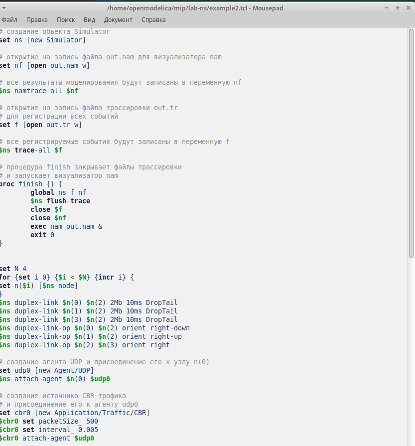
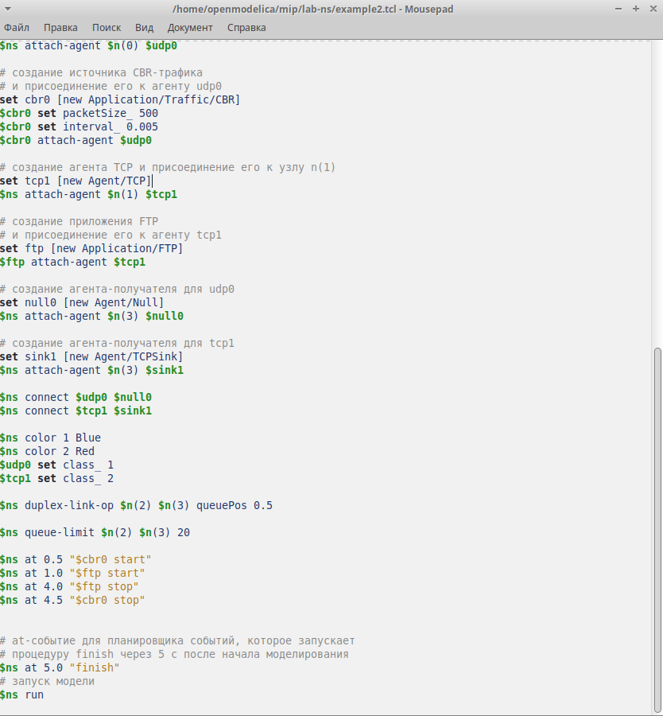
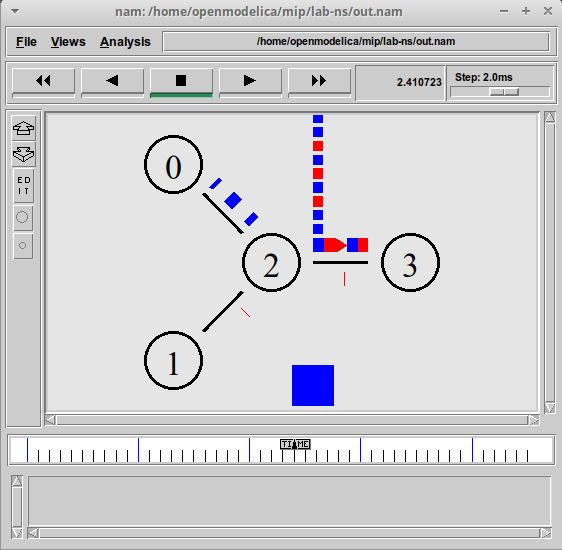
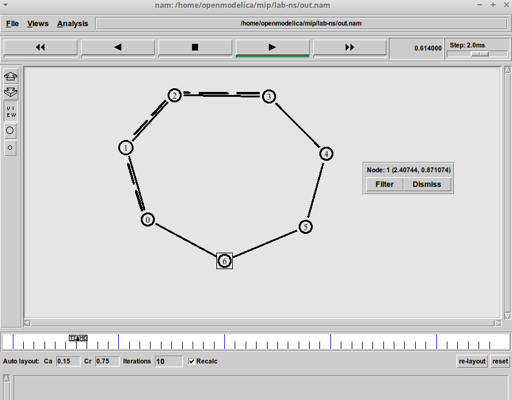
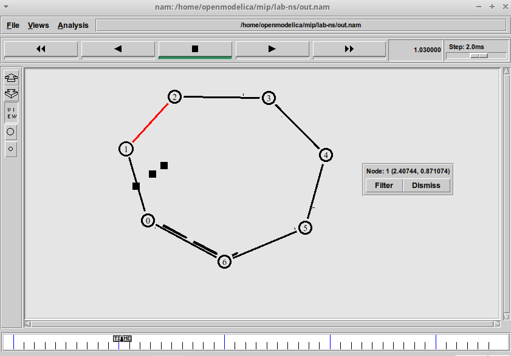
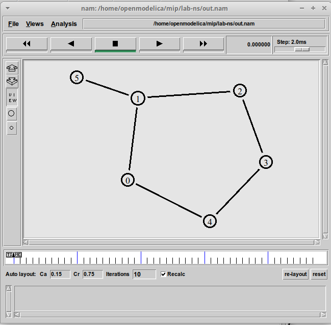

---
## Front matter
lang: ru-RU
title: Лабораторная работа №1
subtitle: простые модели комьютеров сети
author:
  - Джахангиров Илгар Залид оглы
institute:
  - Российский университет дружбы народов, Москва, Россия

## i18n babel
babel-lang: russian
babel-otherlangs: english

## Formatting pdf
toc: false
toc-title: Содержание
slide_level: 2
aspectratio: 169
section-titles: true
theme: metropolis
header-includes:
 - \metroset{progressbar=frametitle,sectionpage=progressbar,numbering=fraction}
 - '\makeatletter'
 - '\beamer@ignorenonframefalse'
 - '\makeatother'
---

# Информация

## Докладчик

:::::::::::::: {.columns align=center}
::: {.column width="70%"}

  * Джахангиров Илгар Залид оглы
  * студент
  * Российский университет дружбы народов
  * [1032225689@pfur.ru]

:::
::::::::::::::

## Цель работы

# Цель работы

Приобретение навыков моделирования сетей передачи данных с помощью средства имитационного моделирования NS-2, а также анализ полученных результатов
моделирования

## Задание
1.	создать Шаблон сценария для NS-2
2.	Простой пример описания топологии сети, состоящей из двух

## Выполнение лабораторной работы 

## Выполнение лабораторной работы 

Сохранив изменения в отредактированном файле и запустив симулятор, получим
анимированный результат моделирования (рис. 1.3).
При запуске скрипта можно заметить, что по соединениям между узлами n(0)–n(2)
и n(1)–n(2) к узлу n(2) передаётся данных больше, чем способно передаваться по
соединению от узла n(2) к узлу n(3). Действительно, мы передаём 200 пакетов
в секунду от каждого источника данных в узлах n(0) и n(1), а каждый пакет имеет
размер 500 байт. Таким образом, полоса каждого соединения 0, 8 Mb, а суммарная
— 1, 6 Mb. Но соединение n(2)–n(3) имеет полосу лишь 1 Mb. Следовательно, часть
пакетов должна теряться. В окне аниматора можно видеть пакеты в очереди, а также
те пакеты, которые отбрасываются при переполнении

## Выполнение лабораторной работы 

Постановка задачи. Требуется построить модель передачи данных по сети с кольцевой топологией и динамической маршрутизацией пакетов:
– сеть состоит из 7 узлов, соединённых в кольцо;
– данные передаются от узла n(0) к узлу n(3) по кратчайшему пути;
– с 1 по 2 секунду модельного времени происходит разрыв соединения между
узлами n(1) и n(2);

## Выполнение лабораторной работы 

## Выполнение лабораторной работы 

передача данных должна осуществляться от узла n(0) до узла n(5) по кратчайшему пути в течение 5 секунд модельного времени;
– передача данных должна идти по протоколу TCP (тип Newreno), на принимающей стороне используется TCPSink-объект типа DelAck; поверх TCP работает
протокол FTP с 0,5 до 4,5 секунд модельного времени;
– с 1 по 2 секунду модельного времени происходит разрыв соединения между
узлами n(0) и n(1);
– при разрыве соединения маршрут передачи данных должен измениться на резервный, после восстановления соединения пакеты снова должны пойти по
кратчайшему пути.

# Выводы

В процессе выполнения данной лабораторной работы я приобрел навыки по моделирования сетей передачи данных с помощью средства имитационного моделирования NS-2, а так же анализ и получение результат и моделирование.