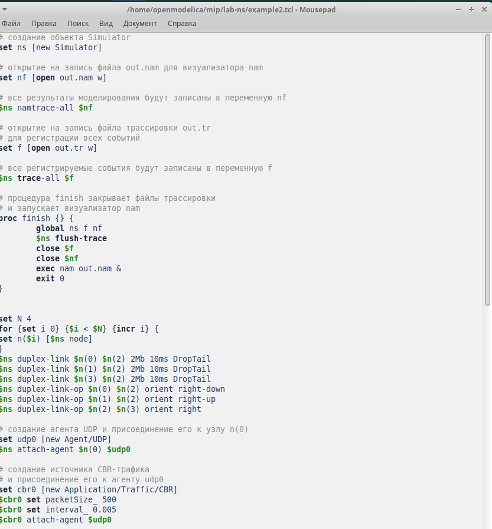
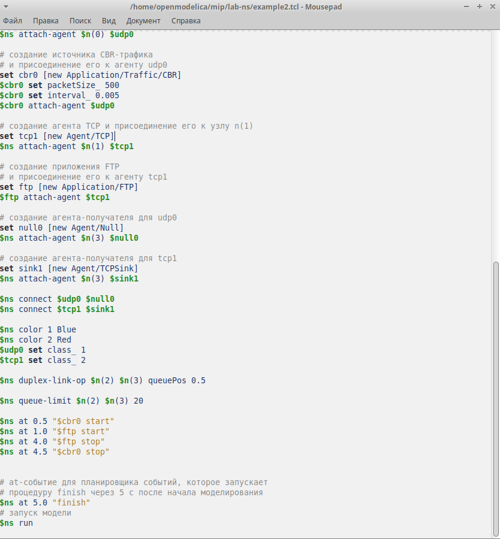
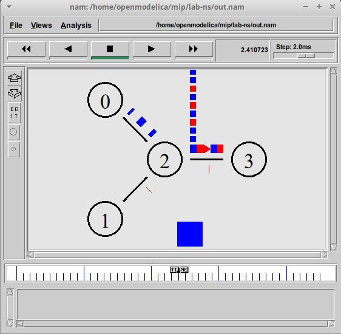
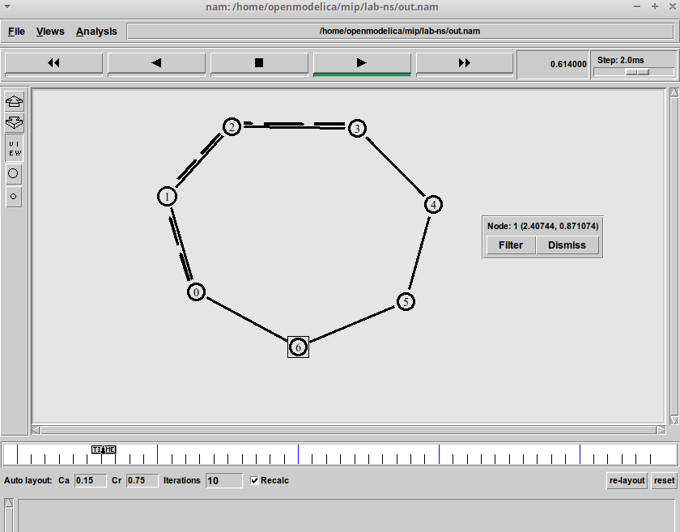
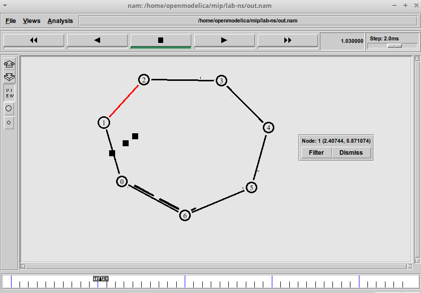
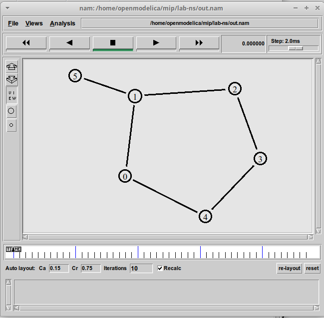

---
## Front matter
title: "Лабораторная работа № 1"
subtitle: "простые модели комьютеров сети"
author: "Джахангиров Илгар Залид оглы"

## Generic otions
lang: ru-RU
toc-title: "Содержание"

## Bibliography
bibliography: bib/cite.bib
csl: pandoc/csl/gost-r-7-0-5-2008-numeric.csl

## Pdf output format
toc: true # Table of contents
toc-depth: 2
lof: true # List of figures
lot: false # List of tables
fontsize: 12pt
linestretch: 1.5
papersize: a4
documentclass: scrreprt
## I18n polyglossia
polyglossia-lang:
  name: russian
  options:
	- spelling=modern
	- babelshorthands=true
polyglossia-otherlangs:
  name: english
## I18n babel
babel-lang: russian
babel-otherlangs: english
## Fonts
mainfont: PT Serif
romanfont: PT Serif
sansfont: PT Sans
monofont: PT Mono
mainfontoptions: Ligatures=TeX
romanfontoptions: Ligatures=TeX
sansfontoptions: Ligatures=TeX,Scale=MatchLowercase
monofontoptions: Scale=MatchLowercase,Scale=0.9
## Biblatex
biblatex: true
biblio-style: "gost-numeric"
biblatexoptions:
  - parentracker=true
  - backend=biber
  - hyperref=auto
  - language=auto
  - autolang=other*
  - citestyle=gost-numeric
## Pandoc-crossref LaTeX customization
figureTitle: "Рис."
tableTitle: "Таблица"
listingTitle: "Листинг"
lofTitle: "Список иллюстраций"
lotTitle: "Список таблиц"
lolTitle: "Листинги"
## Misc options
indent: true
header-includes:
  - \usepackage{indentfirst}
  - \usepackage{float} # keep figures where there are in the text
  - \floatplacement{figure}{H} # keep figures where there are in the text
---

# Цель работы

Приобретение навыков моделирования сетей передачи данных с помощью средства имитационного моделирования NS-2, а также анализ полученных результатов
моделирования

# Задание
1.	создать Шаблон сценария для NS-2
2.	Простой пример описания топологии сети, состоящей из двух

# Выполнение лабораторной работы 

Сохранив изменения в отредактированном файле и запустив симулятор, получим
анимированный результат моделирования (рис. 1.3).
При запуске скрипта можно заметить, что по соединениям между узлами n(0)–n(2)
и n(1)–n(2) к узлу n(2) передаётся данных больше, чем способно передаваться по
соединению от узла n(2) к узлу n(3). Действительно, мы передаём 200 пакетов
в секунду от каждого источника данных в узлах n(0) и n(1), а каждый пакет имеет
размер 500 байт. Таким образом, полоса каждого соединения 0, 8 Mb, а суммарная
— 1, 6 Mb. Но соединение n(2)–n(3) имеет полосу лишь 1 Mb. Следовательно, часть
пакетов должна теряться. В окне аниматора можно видеть пакеты в очереди, а также
те пакеты, которые отбрасываются при переполнении

Постановка задачи. Требуется построить модель передачи данных по сети с кольцевой топологией и динамической маршрутизацией пакетов:
– сеть состоит из 7 узлов, соединённых в кольцо;
– данные передаются от узла n(0) к узлу n(3) по кратчайшему пути;
– с 1 по 2 секунду модельного времени происходит разрыв соединения между
узлами n(1) и n(2);

передача данных должна осуществляться от узла n(0) до узла n(5) по кратчайшему пути в течение 5 секунд модельного времени;
– передача данных должна идти по протоколу TCP (тип Newreno), на принимающей стороне используется TCPSink-объект типа DelAck; поверх TCP работает
протокол FTP с 0,5 до 4,5 секунд модельного времени;
– с 1 по 2 секунду модельного времени происходит разрыв соединения между
узлами n(0) и n(1);
– при разрыве соединения маршрут передачи данных должен измениться на резервный, после восстановления соединения пакеты снова должны пойти по
кратчайшему пути.

# Выводы

В процессе выполнения данной лабораторной работы я приобрел навыки по моделирования сетей передачи данных с помощью средства имитационного моделирования NS-2, а так же анализ и получение результат и моделирование.