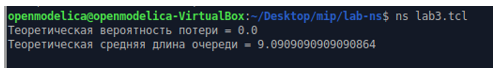
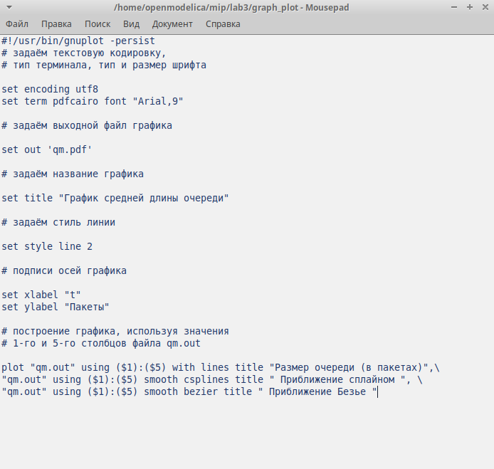
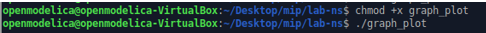
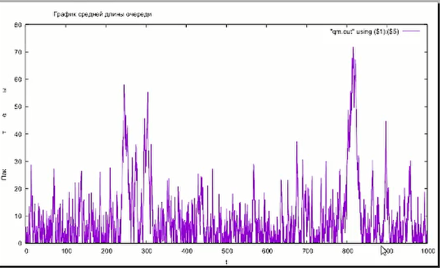
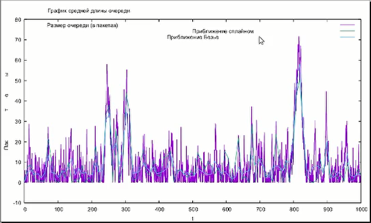

---
## Front matter
lang: ru-RU
title: Лабораторная работа №3
subtitle: Моделирование стохастических процессов
author:
  - Джахангиров Илгар Залид оглы
institute:
  - Российский университет дружбы народов, Москва, Россия

## i18n babel
babel-lang: russian
babel-otherlangs: english

## Formatting pdf
toc: false
toc-title: Содержание
slide_level: 2
aspectratio: 169
section-titles: true
theme: metropolis
header-includes:
 - \metroset{progressbar=frametitle,sectionpage=progressbar,numbering=fraction}
 - '\makeatletter'
 - '\beamer@ignorenonframefalse'
 - '\makeatother'
---

# Информация

## Докладчик

:::::::::::::: {.columns align=center}
::: {.column width="70%"}

  * Джахангиров Илгар Залид оглы
  * студент
  * Российский университет дружбы народов
  * [1032225689@pfur.ru]

:::
::::::::::::::

## Цель работы

Провести моделирование системы массового обслуживания (СМО).

## Задание

1. Реализовать модель $M|M|1$;
2. Посчитать загрузку системы и вероятность потери пакетов;
3. Построить график изменения размера очереди.

## Выполнение лабораторной работы

$M|M|1$ -- это однолинейная СМО с накопителем бесконечной ёмкости. Поступающий поток заявок — пуассоновский с интенсивностью $\lambda$. Времена обслуживания
заявок — независимые в совокупности случайные величины, распределённые по
экспоненциальному закону с параметром $\mu$.

Реализуем эту систему. 
Зададим параметры системы $\lambda = 30, \, \mu = 33$, размер очереди 100000, длительность эксперимента 100000. Далее задаем узлы, между которыми будут идти пакеты, и соединяем их симплексным соединением с полосой пропускания 100 Кб/с и задержкой 0 мс, очередью с обслуживанием типа DropTail. Наложим ограничения на размер очереди. Источником трафика ставим UDP-агент, приемником Null-агент. Также осуществим мониторинг очереди. Процедура finish закрывает файлы трассировки. Процедура sendpack -- случайно генерирует пакеты по экспоненциальному распределению. Также в данной сценарии рассчитывается по формулам загрузка система и вероятность потери пакетов.

```
# создание объекта Simulator
set ns [new Simulator]
# открытие на запись файла out.tr для регистрации событий
set tf [open out.tr w]
$ns trace-all $tf
# задаём значения параметров системы
set lambda 30.0
set mu 33.0
# размер очереди для M|M|1 (для M|M|1|R: set qsize R)
set qsize 100000
# устанавливаем длительность эксперимента
set duration 1000.0
# задаём узлы и соединяем их симплексным соединением
# с полосой пропускания 100 Кб/с и задержкой 0 мс,
# очередью с обслуживанием типа DropTail
set n1 [$ns node]
set n2 [$ns node]

set link [$ns simplex-link $n1 $n2 100kb 0ms DropTail]
# наложение ограничения на размер очереди:
$ns queue-limit $n1 $n2 $qsize
# задаём распределения интервалов времени
# поступления пакетов и размера пакетов
set InterArrivalTime [new RandomVariable/Exponential]
$InterArrivalTime set avg_ [expr 1/$lambda]
set pktSize [new RandomVariable/Exponential]
$pktSize set avg_ [expr 100000.0/(8*$mu)]
# задаём агент UDP и присоединяем его к источнику,
# задаём размер пакета
set src [new Agent/UDP]
$src set packetSize_ 100000
$ns attach-agent $n1 $src
# задаём агент-приёмник и присоединяем его
set sink [new Agent/Null]
$ns attach-agent $n2 $sink
$ns connect $src $sink
# мониторинг очереди
set qmon [$ns monitor-queue $n1 $n2 [open qm.out w] 0.1]
$link queue-sample-timeout
# процедура finish закрывает файлы трассировки
proc finish {} {
  global ns tf
  $ns flush-trace
  close $tf
  exit 0
}
# процедура случайного генерирования пакетов
proc sendpacket {} {
  global ns src InterArrivalTime pktSize
  set time [$ns now]
  $ns at [expr $time +[$InterArrivalTime value]] "sendpacket"
  set bytes [expr round ([$pktSize value])]
  $src send $bytes
}
# планировщик событий
$ns at 0.0001 "sendpacket"
$ns at $duration "finish"
# расчет загрузки системы и вероятности потери пакетов
set rho [expr $lambda/$mu]
set ploss [expr (1-$rho)*pow($rho,$qsize)/(1-pow($rho,($qsize+1)))]
puts "Теоретическая вероятность потери = $ploss"

set aveq [expr $rho*$rho/(1-$rho)]
puts "Теоретическая средняя длина очереди = $aveq"
# запуск модели
$ns run
```

Запустив эту программу, получим значения  загрузки системы и вероятности потери пакетов 

## Выполнение лабораторной работы



В каталоге с проектом создадим отдельный файл, например, graph_plot `touch graph_plot`.
Откроем его на редактирование и добавим следующий код, обращая внимание на синтаксис GNUplot 

## Выполнение лабораторной работы



Сделаем файл исполняемым. После компиляции файла с проектом, запустим скрипт в созданном файле graph_plot , который создаст файл qm.png с результатами моделирования 

## Выполнение лабораторной работы



## Выполнение лабораторной работы



## Выполнение лабораторной работы



На данном графике изображен размер очереди в пакетах, а также его приближение сплайном и Безье.

## Выводы

В процессе выполнения данной лабораторной работы я провел моделирование системы массового обслуживания (СМО).


