---
## Front matter
lang: ru-RU
title: Лабораторная работа №5
subtitle: Модель эпидемии (SIR)
author:
  - Джахангиров Илгар Залид оглы
institute:
  - Российский университет дружбы народов, Москва, Россия

## i18n babel
babel-lang: russian
babel-otherlangs: english

## Formatting pdf
toc: false
toc-title: Содержание
slide_level: 2
aspectratio: 169
section-titles: true
theme: metropolis
header-includes:
 - \metroset{progressbar=frametitle,sectionpage=progressbar,numbering=fraction}
 - '\makeatletter'
 - '\beamer@ignorenonframefalse'
 - '\makeatother'
---

# Информация

## Докладчик

:::::::::::::: {.columns align=center}
::: {.column width="70%"}

  * Джахангиров Илгар Залид оглы
  * студент
  * Российский университет дружбы народов
  * [1032225689@pfur.ru]

:::
::::::::::::::

## Цель работы

Построить модель SIR в *xcos* и OpenModelica.

## Задание

1. Реализовать модель SIR в в *xcos*;
2. Реализовать модель SIR с помощью блока Modelica в в *xcos*;
3. Реализовать модель SIR в OpenModelica;
4. Реализовать модель SIR с учётом процесса рождения / гибели особей в xcos (в том числе и с использованием блока Modelica), а также в OpenModelica;
5. Построить графики эпидемического порога при различных значениях параметров модели (в частности изменяя параметр $\mu$);
6. Сделать анализ полученных графиков в зависимости от выбранных значений параметров модели.

## Выполнение лабораторной работы

Задача о распространении эпидемии описывается системой дифференциальных уравнений:

$$
\begin{cases}
  \dot s = - \beta s(t)i(t); \\
  \dot i = \beta s(t)i(t) - \nu i(t);\\
  \dot r = \nu i(t),
\end{cases}
$$

где $\beta$ -- скорость заражения, $\nu$ -- скорость выздоровления.

## Реализация модели в xcos

Зафиксируем начальные данные: $\beta = 1, \, \nu = 0,3, s(0) = 0,999, \, i(0) = 0,001, \, r(0) = 0.$
 
В меню Моделирование, Установить контекст зададим значения переменных $\beta$ и $\nu$ (рис. 

## Выполнение лабораторной работы

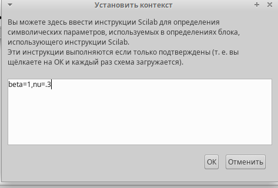

Для реализации модели  потребуются следующие блоки xcos:

- `CLOCK_c` -- запуск часов модельного времени;
- `CSCOPE` -- регистрирующее устройство для построения графика;
- `TEXT_f` -- задаёт текст примечаний;
- `MUX` -- мультиплексер, позволяющий в данном случае вывести на графике сразу
несколько кривых;
- `INTEGRAL_m` -- блок интегрирования;
- `GAINBLK_f` -- в данном случае позволяет задать значения коэффициентов $\beta$ и $\nu$ ;
- `SUMMATION` -- блок суммирования;
- `PROD_f` -- поэлементное произведение двух векторов на входе блока.

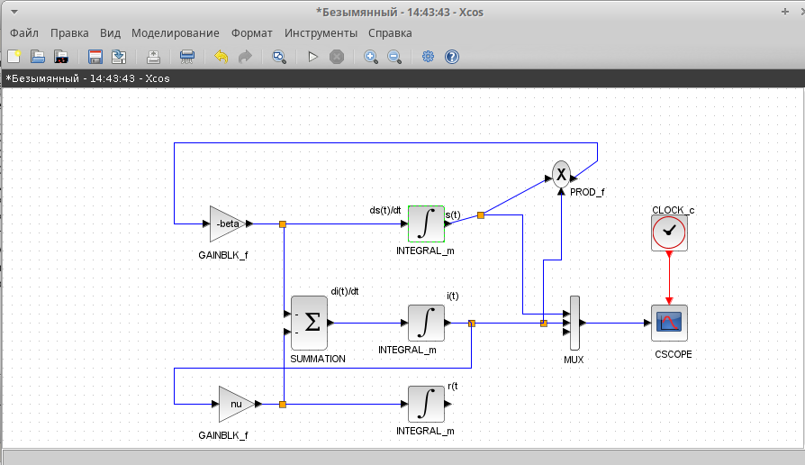

В параметрах верхнего и среднего блока интегрирования необходимо задать начальные значения $s(0) = 0,999$ и $i(0) = 0,001$  

## Выполнение лабораторной работы

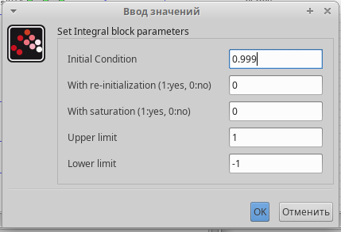

## Выполнение лабораторной работы

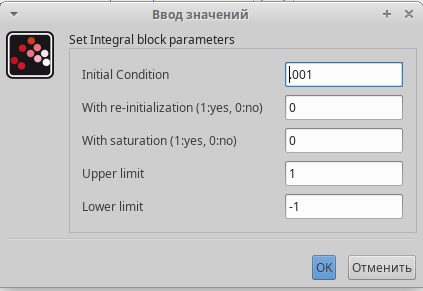

В меню Моделирование, Установка зададим конечное время интегрирования, равным времени моделирования, в данном случае 30 
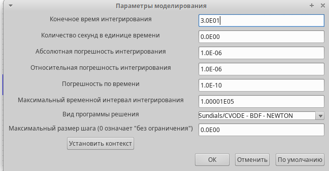

Результат моделирования представлен на рис., где черной линией обозначен график $s(t)$ (динамика численности уязвимых к болезни особей), красная
линия определяет $r(t)$ — динамику численности выздоровевших особей, наконец,
зеленая линия определяет $i(t)$ — динамику численности заражённых
особей. Пересечение трёх линий определяет порог эпидемии.

## Выполнение лабораторной работы


## Реализация модели с помощью блока Modelica в xcos

Готовая модель SIR представлена на рис. 

Для реализации модели SIR с помощью языка Modelica помимо блоков `CLOCK_c`,
`CSCOPE`, `TEXT_f` и `MUX` требуются блоки `CONST_m` — задаёт константу; `MBLOCK`
(Modelica generic) — блок реализации кода на языке Modelica. Задаём значения
переменных $\beta$ и $\nu$ .

## Выполнение лабораторной работы

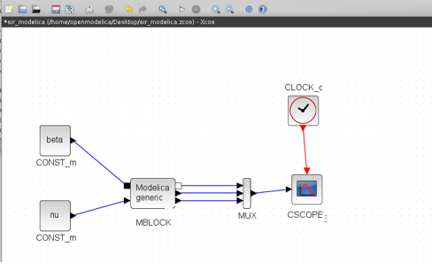

Параметры блока Modelica представлены на рис. . Переменные на входе (“beta”, “nu”) и выходе (“s”, “i”, “r”) блока заданы как внешние (“E”).

## Выполнение лабораторной работы

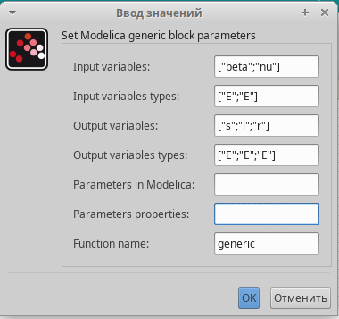

## Выполнение лабораторной работы

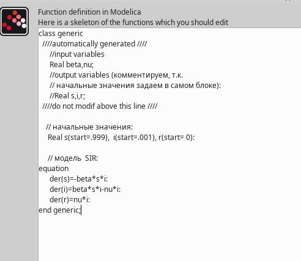

В результате получаем график , построенный с помощью блока Modelica идентичный графику , построенному без них.

## Выполнение лабораторной работы

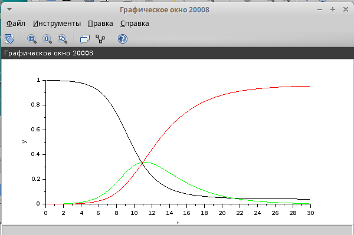

## Упражнение

В качестве упражнения нам надо построить модель SIR на OpenModelica. Синтаксис почти такой же как и на Modelica. Нужно задать параметры, начальные значения и систему дифференциальных уравнений. 

```
  parameter Real I_0 = 0.001;
  parameter Real R_0 = 0;
  parameter Real S_0 = 0.999;
  parameter Real beta = 1;
  parameter Real nu = 0.3;
  parameter Real mu = 0.5;
  
  Real s(start=S_0);
  Real i(start=I_0);
  Real r(start=R_0);
  
equation
  der(s)=-beta*s*i;
  der(i)=beta*s*i-nu*i;
  der(r)=nu*i;
```

Теперь выполним симуляции, задав конечное время 30 с .

## Выполнение лабораторной работы

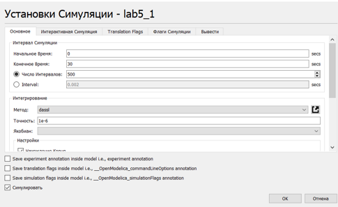

В результате получаем следующий график . Он идентичен предыдущим графикам выполненным в *xcos*.

## Выполнение лабораторной работы

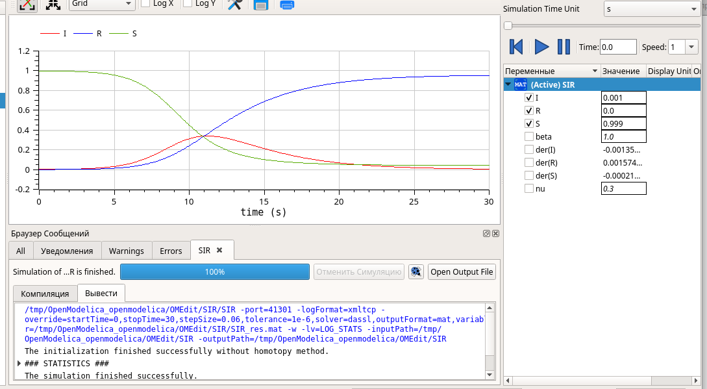

## Задание для самостоятельного выполнения

Предположим, что в модели SIR учитываются демографические процессы, в частности, что смертность
в популяции полностью уравновешивает рождаемость, а все рожденные индивидуумы появляются на свет абсолютно здоровыми. Тогда получим следующую систему
уравнений:

$$
\begin{cases}
  \dot s = - \beta s(t)i(t) + \mu (N - s(t)); \\
  \dot i = \beta s(t)i(t) - \nu i(t) - \mu i(t);\\
  \dot r = \nu i(t) - \mu r(t),
\end{cases}
$$

где $\mu$ — константа, которая равна коэффициенту смертности и рождаемости.

Реализуем эту модель в *xcos*. Тут нам понадобятся три блока суммирования и 4 блока констант (добавляется константа $\nu$).

## Выполнение лабораторной работы

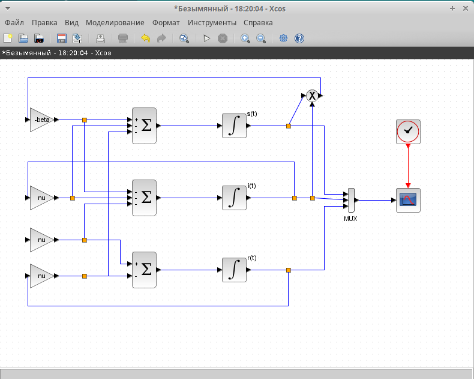

В результате получаем следующий график .

## Выполнение лабораторной работы

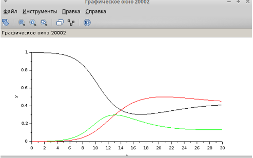

Теперь реализуем модель SIR с учетом демографических процессов в *xcos* с помощью блоков Modelica ).

## Выполнение лабораторной работы


В результате получаем следующий график

## Выполнение лабораторной работы

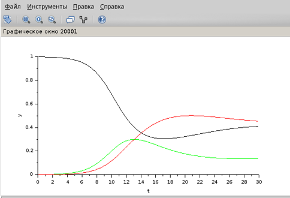

## Выполнение лабораторной работы

Выполнив симуляцию, получим следующий график 

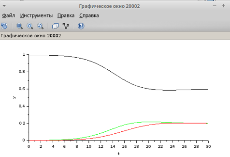

  - $\mu = 0.9$

## Выполнение лабораторной работы

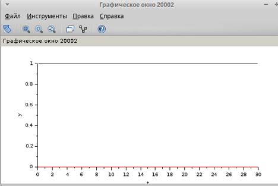

2) $\beta = 1$, $\nu = 0.1$

  - $\mu = 0.1$

## Выполнение лабораторной работы

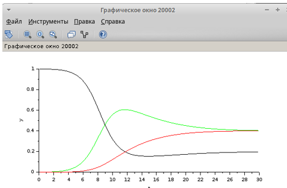

  - $\mu = 0.9$

## Выполнение лабораторной работы

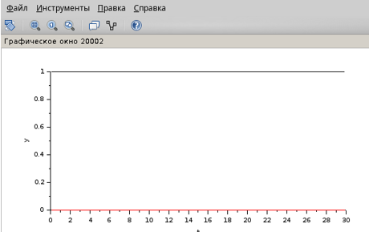

3) $\beta = 4$, $\nu = 0.3, \mu = 0.2$

## Выполнение лабораторной работы

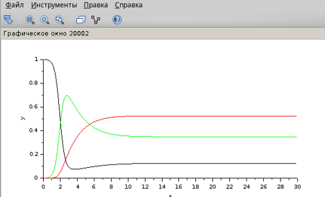}

Исходя из анализа графиков, можно сделать вывод, что чем выше значение любого из параметров, тем быстрее система достигает стационарного
состояния. При высоком коэффициенте заражения $\beta$ система быстро проходит через пик развития эпидемии и достигает стационарного состояния.


## Выводы

В процессе выполнения данной лабораторной работы был построен модель SIR в *xcos* и OpenModelica.

спасибо за внимание