---
## Front matter
lang: ru-RU
title: Лабораторная работа №6
subtitle: Модель «хищник–жертва
author:
  - Джахангиров Илгар Залид оглы
institute:
  - Российский университет дружбы народов, Москва, Россия

## i18n babel
babel-lang: russian
babel-otherlangs: english

## Formatting pdf
toc: false
toc-title: Содержание
slide_level: 2
aspectratio: 169
section-titles: true
theme: metropolis
header-includes:
 - \metroset{progressbar=frametitle,sectionpage=progressbar,numbering=fraction}
 - '\makeatletter'
 - '\beamer@ignorenonframefalse'
 - '\makeatother'
---

# Информация

## Докладчик

:::::::::::::: {.columns align=center}
::: {.column width="70%"}

  * Джахангиров Илгар Залид оглы
  * студент
  * Российский университет дружбы народов
  * [1032225689@pfur.ru]

:::
::::::::::::::

## Цель работы

Реализовать модель "хищник-жертва" в *xcos*.

## Задание

1. Реализовать модель "хищник-жертва" в xcos;
2. Реализовать модель "хищник-жертва" с помощью блока Modelica в xcos;
3. Реализовать модель "хищник-жертва" в OpenModelica

## Выполнение лабораторной работы

Модель «хищник–жертва» (модель Лотки — Вольтерры) представляет собой модель
межвидовой конкуренции. В математической
форме модель имеет вид:

$$
\begin{cases}
  \dot x = ax - bxy \\
  \dot y = cxy - dy,
\end{cases}
$$

где $x$ — количество жертв; $y$ — количество хищников; $a, b, c, d$ — коэффициенты, отражающие взаимодействия между видами: $a$ — коэффициент рождаемости
жертв; $b$ — коэффициент убыли жертв; $c$ — коэффициент рождения хищников; $d$ —
коэффициент убыли хищников.

## Реализация модели в xcos

Зафиксируем начальные данные: $a = 2, \, b = 1, \, c = 0.3, \, d = 1, \, x(0) = 2, \, y(0) = 1$.
В меню Моделирование, Задать переменные окружения зададим значения коэффициентов $a, \, b, \, c, \, d$ ъ\.

## Выполнение лабораторной работы

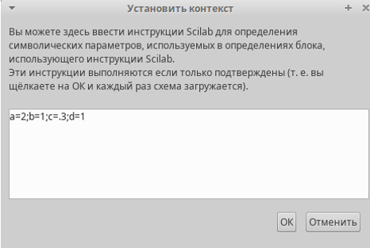

Для реализации модели "хищник-жертва" в дополнение к блокам `CLOCK_c`, `CSCOPE`, `TEXT_f`,
`MUX`, `INTEGRAL_m`, `GAINBLK_f`, `SUMMATION`, `PROD_f` потребуется блок `CSCOPXY` --
регистрирующее устройство для построения фазового портрета.
Готовая модель «хищник–жертва» представлена на рис. .

## Выполнение лабораторной работы

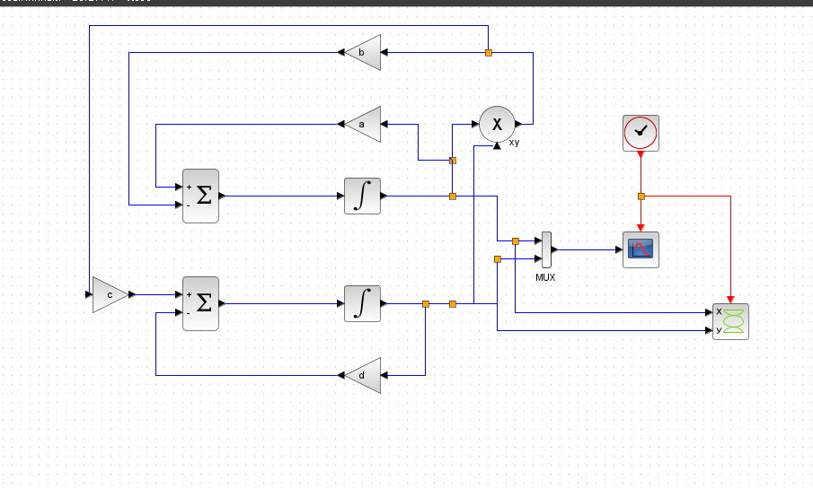

В параметрах блоков интегрирования необходимо задать начальные значения $x(0) = 2, y(0) = 1$ .

## Выполнение лабораторной работы

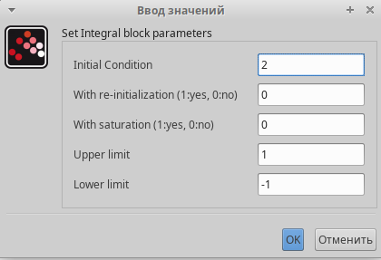

## Выполнение лабораторной работы

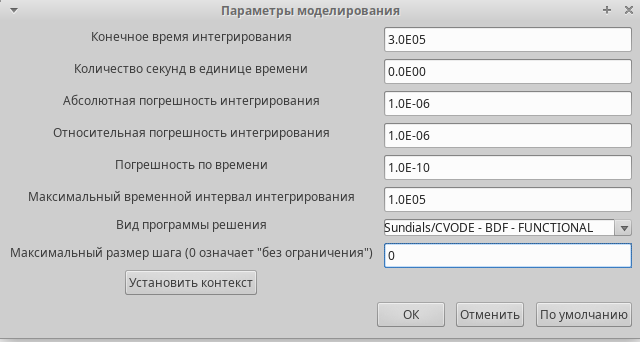

В меню Моделирование, Установка необходимо задать конечное время интегрирования, равным времени моделирования: 30.

Результат моделирования представлен на рис.. Черной линией обозначен график $x(t)$ (динамика численности жертв), зеленая линия определяет $y(t)$ — динамику численности хищников

## Выполнение лабораторной работы

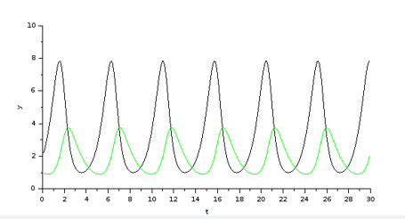

На рис.  приведён фазовый портрет модели Лотки-Вольтерры.

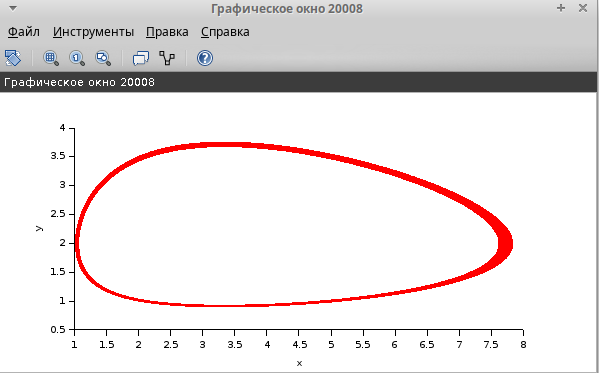

## Реализация модели с помощью блока Modelica в xcos

Для реализации модели с помощью языка Modelica потребуются следующие
блоки *xcos*: `CLOCK_c`, `CSCOPE`, `CSCOPXY`, `TEXT_f`, `MUX`, `CONST_m` и `MBLOCK` (Modelica
generic).
Как и ранее, задаём значения коэффициентов $a, b, c, d$ .
Готовая модель «хищник–жертва» представлена на .
Параметры блока Modelica представлены на рис. Переменные на входе (“a”,
“b”, “c”, “d”) и выходе (“x”, “y”) блока заданы как внешние (“E”).

## Выполнение лабораторной работы

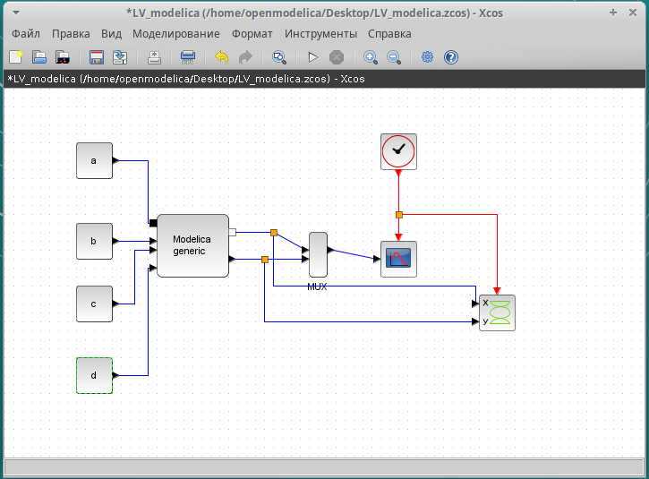

## Выполнение лабораторной работы

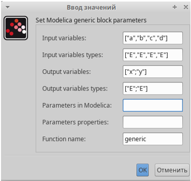

## Выполнение лабораторной работы

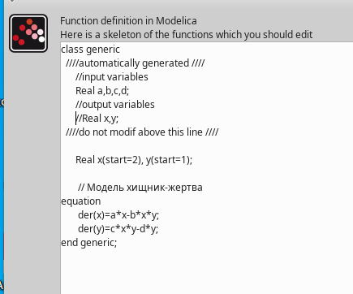

В результате моделирования получаем следующие графики . Они идентичны построенным без блока Modelica.

## Выполнение лабораторной работы

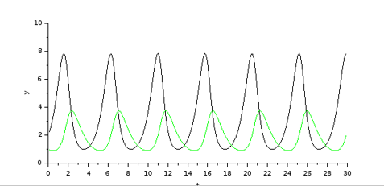

## Выполнение лабораторной работы

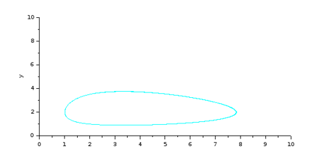

## Выводы

В процессе выполнения данной лабораторной реализована модель "хищник-жертва" в *xcos*.
