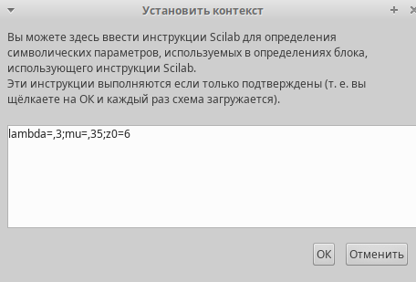
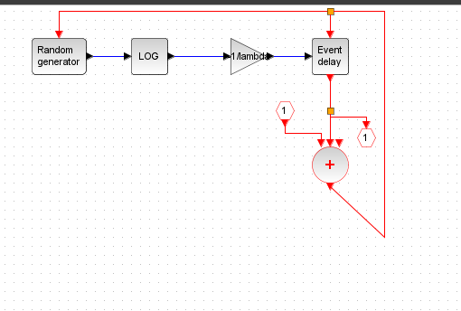
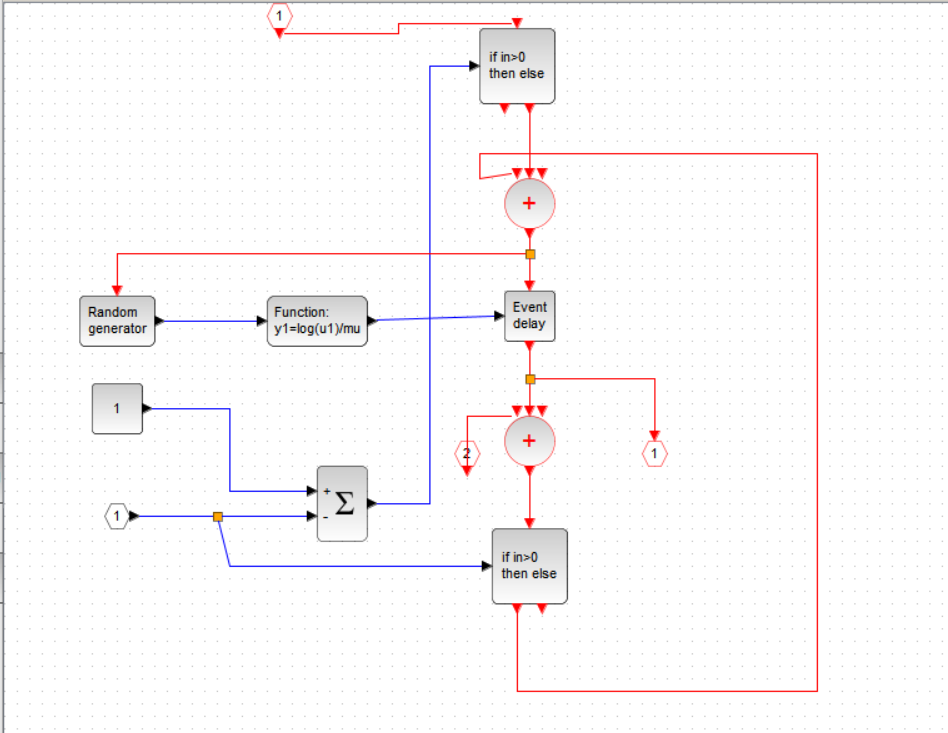
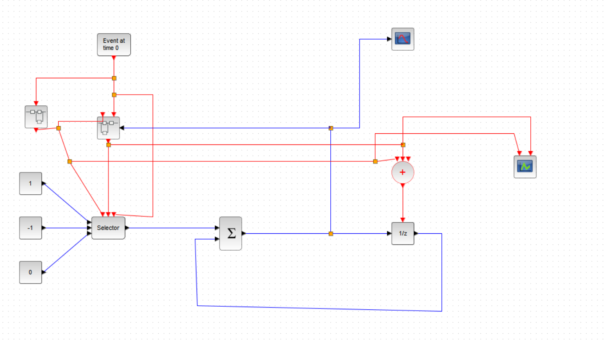
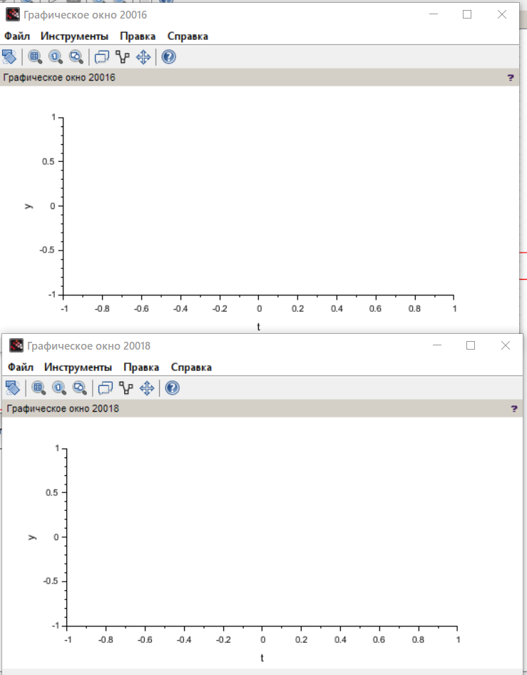

---
## Front matter
lang: ru-RU
title: Лабораторная работа №7
subtitle: Модель M|M|1|
author:
  - Джахангиров Илгар Залид оглы
institute:
  - Российский университет дружбы народов, Москва, Россия

## i18n babel
babel-lang: russian
babel-otherlangs: english

## Formatting pdf
toc: false
toc-title: Содержание
slide_level: 2
aspectratio: 169
section-titles: true
theme: metropolis
header-includes:
 - \metroset{progressbar=frametitle,sectionpage=progressbar,numbering=fraction}
 - '\makeatletter'
 - '\beamer@ignorenonframefalse'
 - '\makeatother'
---

# Информация

## Докладчик

:::::::::::::: {.columns align=center}
::: {.column width="70%"}

  * Джахангиров Илгар Залид оглы
  * студент
  * Российский университет дружбы народов
  * [1032225689@pfur.ru]

:::
::::::::::::::

## Цель работы

Рассмотреть пример моделирования в *xcos* системы массового обслуживания типа $M|M|1|\infty$.

## Задание

1. Реализовать модель системы массового обслуживания типа $M|M|1|\infty$;
2. Построить график поступления и обработки заявок;
3. Построить график динамики размера очереди.

## Выполнение лабораторной работы

Зафиксируем начальные данные: $\lambda = 0.3, \, \mu = 0.35, \, z_0 = 6$. В меню Моделирование, Установить контекст зададим значения коэффициентов (рис. [-@fig:001]).

## Выполнение лабораторной работы

Суперблок, моделирующий поступление заявок, представлен на рис. [-@fig:002]. Тут у нас заявки поступают в систему по пуассоновскому закону. Поступает заявка в суперблок, идет в синхронизатор входных и выходных сигналов, происходит равномерное распределение на интервале $[0; 1]$ (также заявка идет в обработчик событий), далее идет преобразование в экспоненциальное распределение с параметром $\lambda$, далее заявка опять попадает в обработчик событий и выходит из суперблока.

## Выполнение лабораторной работы

Суперблок, моделирующий процесс обработки заявок, представлен на рис. [-@fig:003]. Тут происходит обработка заявок в очереди по экспоненциальному закону.

## Выполнение лабораторной работы

Готовая модель$M|M|1|\infty$ представлена на рис. [-@fig:004]. Тут есть селектор, два суперблока, построенных ранее, первоначальное событие на вход в суперблок, суммирование, оператор задержки (имитация очереди), также есть регистрирующие блоки: регистратор размера очереди и регистратор событий.

## Выполнение лабораторной работы

Результат моделирования представлен на рис. [-@fig:005] . График динамики размера очереди начинается со значения 6, потому что мы указали $z_0 = 6$.

## Выполнение лабораторной работы

## Выводы

В процессе выполнения данной лабораторной работы я рассмотрел пример моделирования в *xcos* системы массового обслуживания типа $M|M|1|\infty$.
