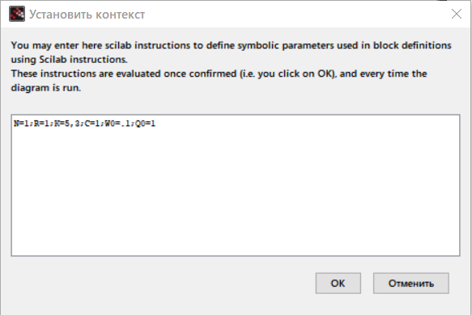
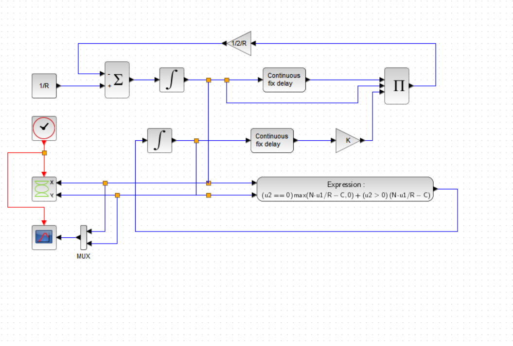
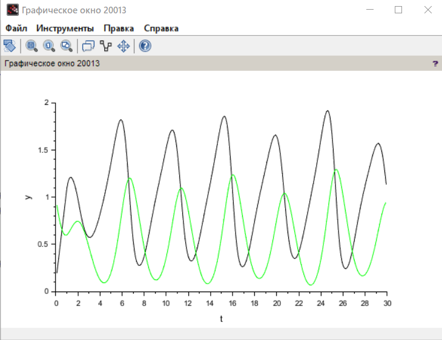
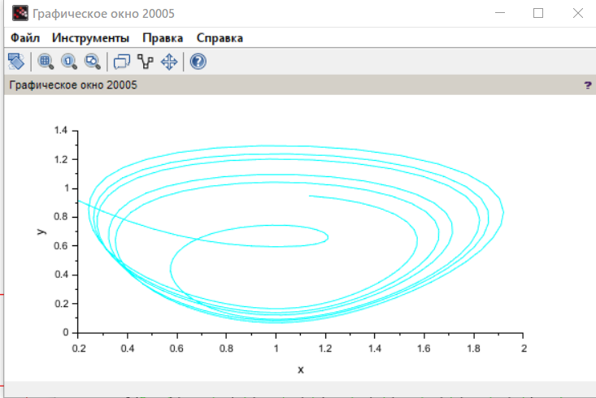
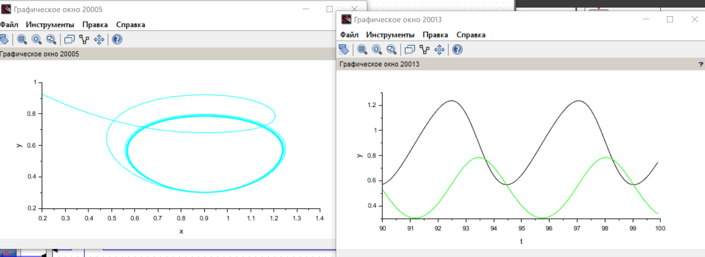
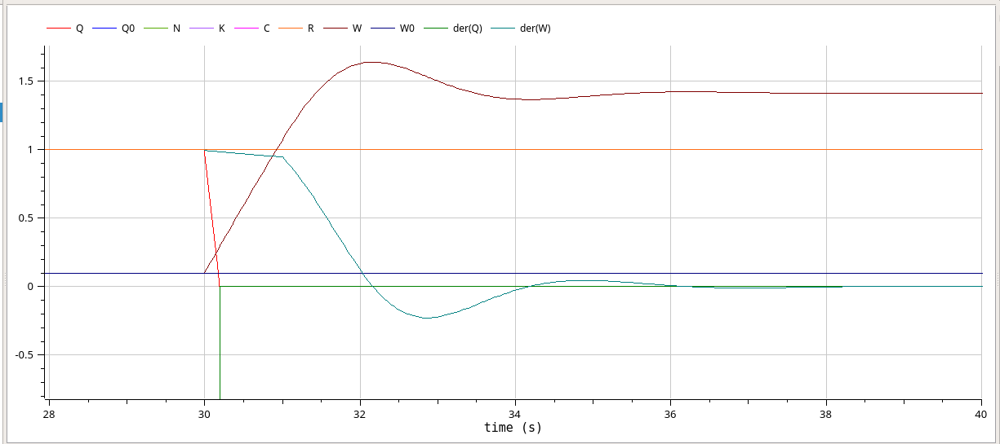

---
## Front matter
lang: ru-RU
title: Лабораторная работа №8
subtitle: Модель TCP/AQM
author:
  - Джахангиров Илгар Залид оглы
institute:
  - Российский университет дружбы народов, Москва, Россия

## i18n babel
babel-lang: russian
babel-otherlangs: english

## Formatting pdf
toc: false
toc-title: Содержание
slide_level: 2
aspectratio: 169
section-titles: true
theme: metropolis
header-includes:
 - \metroset{progressbar=frametitle,sectionpage=progressbar,numbering=fraction}
 - '\makeatletter'
 - '\beamer@ignorenonframefalse'
 - '\makeatother'
---

# Информация

## Докладчик

:::::::::::::: {.columns align=center}
::: {.column width="70%"}

  * Джахангиров Илгар Залид оглы
  * студент
  * Российский университет дружбы народов
  * [1032225689@pfur.ru]

:::
::::::::::::::

## Цель работы

Реализовать модель TCP/AQM в xcos и OpenModelica.

## Задание

1. Построить модель TCP/AQM в xcos;
2. Построить графики динамики изменения размера TCP окна $W(t)$ и размера очереди $Q(t)$;
3. Построить модель TCP/AQM в OpenModelica;

## Выполнение лабораторной работы

## Реализация в xcos

Построим схему xcos, моделирующую нашу систему, с начальными значениями параметров $N = 1, R = 1, K = 5.3, C = 1, W(0) = 0.1, Q(0) = 1$.
Для этого сначала зададим переменные окружения (рис. [-@fig:001]).

## Выполнение лабораторной работы



Затем реализуем модель TCP/AQM, разместив блоки интегрирования, суммирования, произведения, констант, а также регистрирующие устройства (рис. [-@fig:002]):

## Выполнение лабораторной работы



В результате получим динамику изменения размера TCP окна W(t) (зеленая линия) и размера очереди Q(t) (черная линия), а также фазовый портрет, который показывает наличие автоколебаний параметров системы — фазовая траектория осциллирует вокруг своей стационарной точки (рис. :

## Выполнение лабораторной работы



## Выполнение лабораторной работы



Уменьшив скорость обработки пакетов $C$ до $0.9$ увидим, что автоколебания стали более выраженными).

## Выполнение лабораторной работы




## Реализация модели в OpenModelica



Перейдем к реализации модели в OpenModelica. Зададим параметры, начальные значения и систему уравнений.

```

## Выводы

В процессе выполнения данной лабораторной работы я реализовал модель TCP/AQM в xcos и OpenModelica.