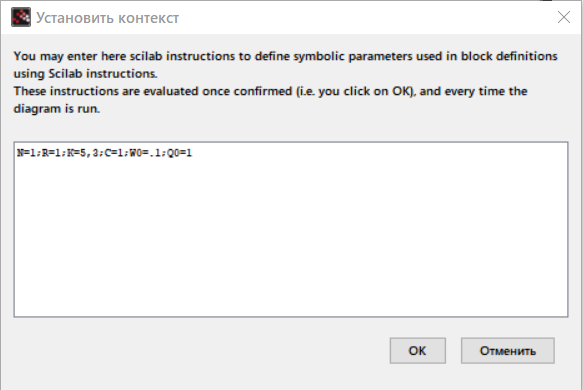
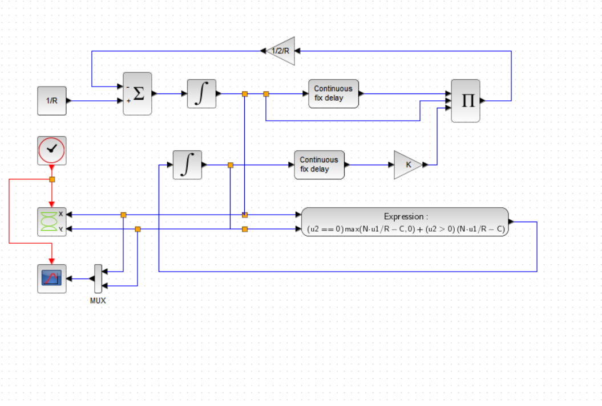
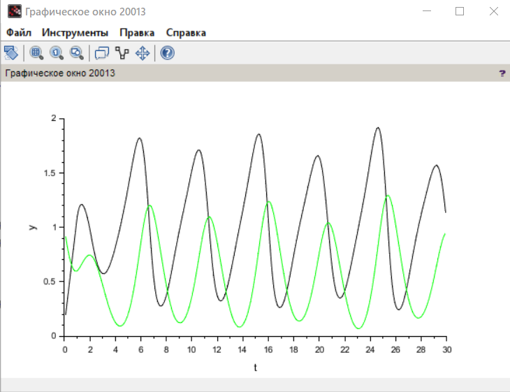
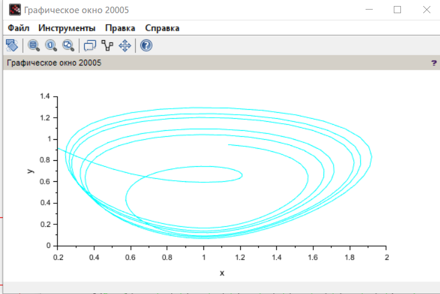
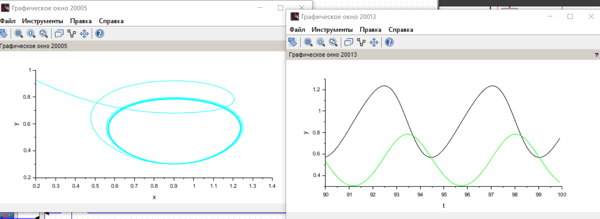
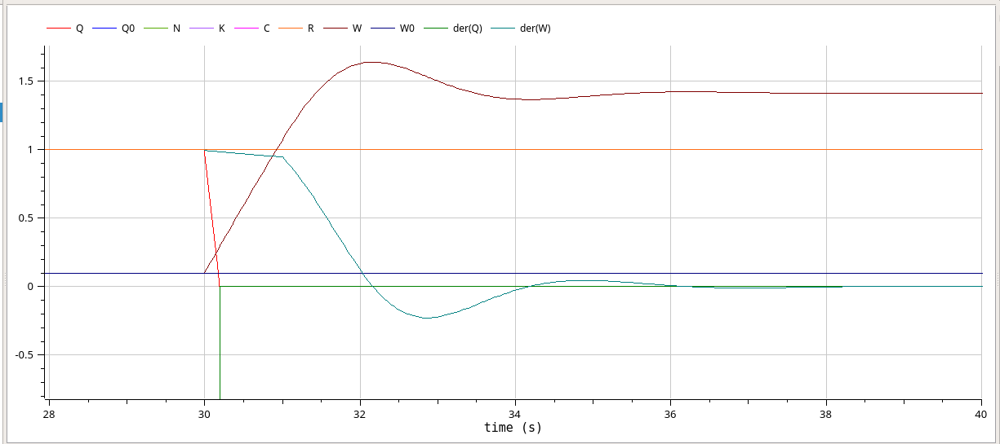

---
## Front matter
title: "Лабораторная работа № 8"
subtitle: "Модель TCP/AQM"
author: "Джахангиров Илгар Залид оглы"

## Generic otions
lang: ru-RU
toc-title: "Содержание"

## Bibliography
bibliography: bib/cite.bib
csl: pandoc/csl/gost-r-7-0-5-2008-numeric.csl

## Pdf output format
toc: true # Table of contents
toc-depth: 2
lof: true # List of figures
lot: false # List of tables
fontsize: 12pt
linestretch: 1.5
papersize: a4
documentclass: scrreprt
## I18n polyglossia
polyglossia-lang:
  name: russian
  options:
	- spelling=modern
	- babelshorthands=true
polyglossia-otherlangs:
  name: english
## I18n babel
babel-lang: russian
babel-otherlangs: english
## Fonts
mainfont: PT Serif
romanfont: PT Serif
sansfont: PT Sans
monofont: PT Mono
mainfontoptions: Ligatures=TeX
romanfontoptions: Ligatures=TeX
sansfontoptions: Ligatures=TeX,Scale=MatchLowercase
monofontoptions: Scale=MatchLowercase,Scale=0.9
## Biblatex
biblatex: true
biblio-style: "gost-numeric"
biblatexoptions:
  - parentracker=true
  - backend=biber
  - hyperref=auto
  - language=auto
  - autolang=other*
  - citestyle=gost-numeric
## Pandoc-crossref LaTeX customization
figureTitle: "Рис."
tableTitle: "Таблица"
listingTitle: "Листинг"
lofTitle: "Список иллюстраций"
lotTitle: "Список таблиц"
lolTitle: "Листинги"
## Misc options
indent: true
header-includes:
  - \usepackage{indentfirst}
  - \usepackage{float} # keep figures where there are in the text
  - \floatplacement{figure}{H} # keep figures where there are in the text
---

# Цель работы

Реализовать модель TCP/AQM в xcos и OpenModelica.

# Задание

1. Построить модель TCP/AQM в xcos;
2. Построить графики динамики изменения размера TCP окна $W(t)$ и размера очереди $Q(t)$;
3. Построить модель TCP/AQM в OpenModelica;

# Выполнение лабораторной работы

## Реализация в xcos

Построим схему xcos, моделирующую нашу систему, с начальными значениями параметров $N = 1, R = 1, K = 5.3, C = 1, W(0) = 0.1, Q(0) = 1$.
Для этого сначала зададим переменные окружения (рис. [-@fig:001]).



Затем реализуем модель TCP/AQM, разместив блоки интегрирования, суммирования, произведения, констант, а также регистрирующие устройства (рис. [-@fig:002]):



В результате получим динамику изменения размера TCP окна W(t) (зеленая линия) и размера очереди Q(t) (черная линия), а также фазовый портрет, который показывает наличие автоколебаний параметров системы — фазовая траектория осциллирует вокруг своей стационарной точки (рис. :





Уменьшив скорость обработки пакетов $C$ до $0.9$ увидим, что автоколебания стали более выраженными).




## Реализация модели в OpenModelica



Перейдем к реализации модели в OpenModelica. Зададим параметры, начальные значения и систему уравнений.

```

# Выводы

В процессе выполнения данной лабораторной работы я реализовал модель TCP/AQM в xcos и OpenModelica.