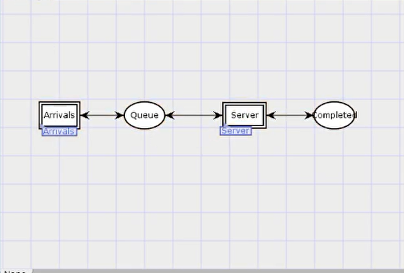
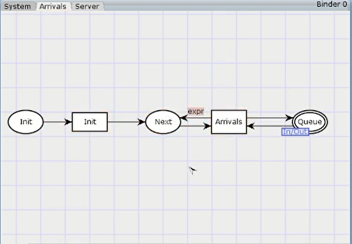
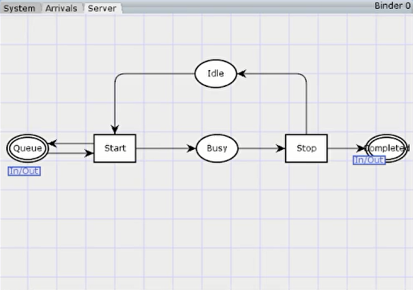
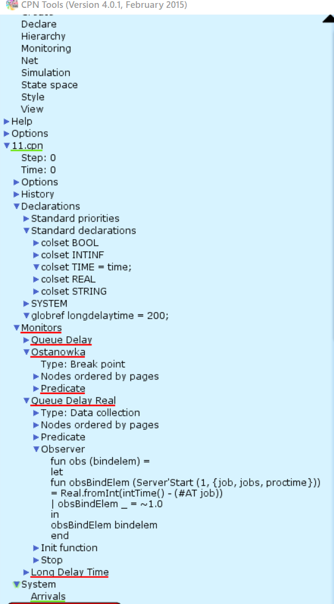
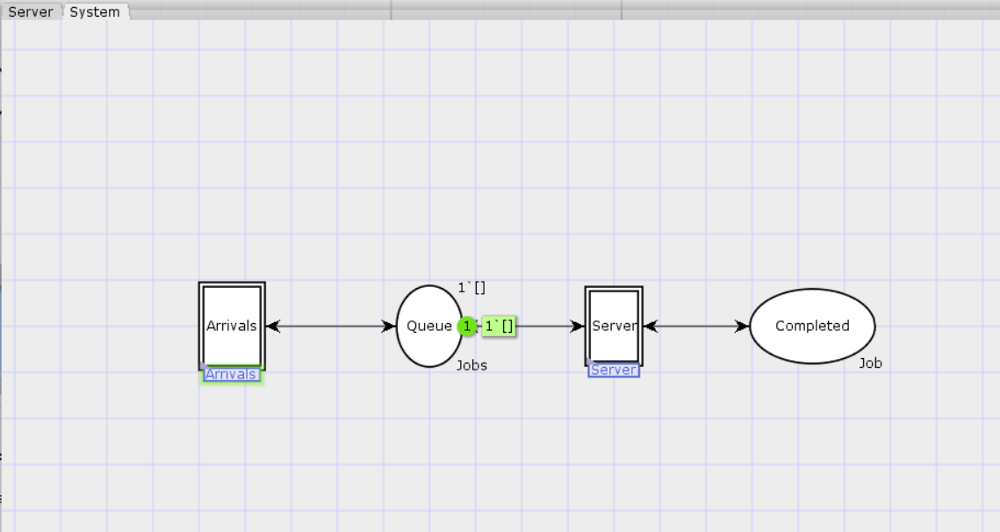
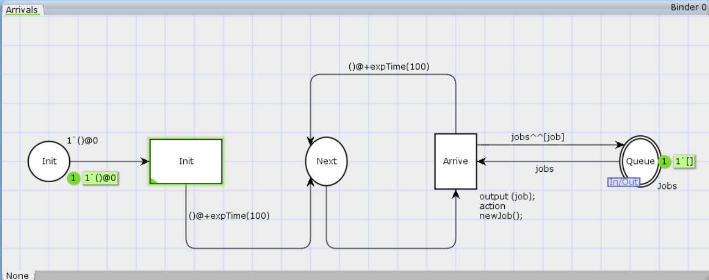
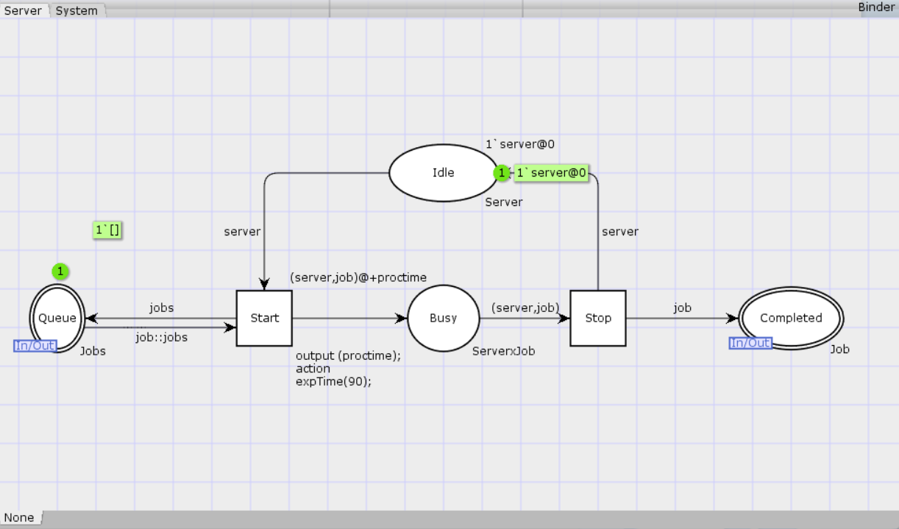
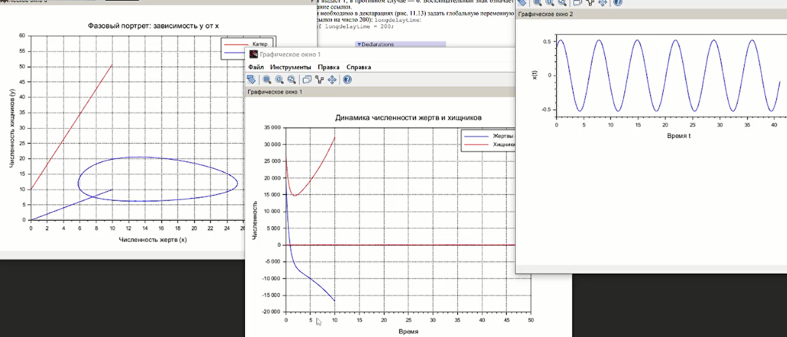

---
## Front matter
lang: ru-RU
title: Лабораторная работа №11
subtitle: Модель системы массового обслуживания $M|M|1$
author:
  - Джахангиров Илгар Залид оглы
institute:
  - Российский университет дружбы народов, Москва, Россия

## i18n babel
babel-lang: russian
babel-otherlangs: english

## Formatting pdf
toc: false
toc-title: Содержание
slide_level: 2
aspectratio: 169
section-titles: true
theme: metropolis
header-includes:
 - \metroset{progressbar=frametitle,sectionpage=progressbar,numbering=fraction}
 - '\makeatletter'
 - '\beamer@ignorenonframefalse'
 - '\makeatother'
---

# Информация

## Докладчик

:::::::::::::: {.columns align=center}
::: {.column width="70%"}

  * Джахангиров Илгар Залид оглы
  * студент
  * Российский университет дружбы народов
  * [1032225689@pfur.ru]

:::
::::::::::::::

## Цель работы

Реализовать модель $M|M|1$ в CPN tools.

## Задание**

- Реализовать в CPN Tools модель системы массового обслуживания M|M|1.
- Настроить мониторинг параметров моделируемой системы и нарисовать графики очереди.

## Выполнение лабораторной работы

# Постановка задачи

В систему поступает поток заявок двух типов, распределённый по пуассоновскому
закону. Заявки поступают в очередь сервера на обработку. Дисциплина очереди -
FIFO. Если сервер находится в режиме ожидания (нет заявок на сервере), то заявка
поступает на обработку сервером.

Будем использовать три отдельных листа: на первом листе опишем граф системы
(рис. [-@fig:001]), на втором — генератор заявок (рис. [-@fig:002]), на третьем — сервер обработки
заявок (рис. [-@fig:003]).

Сеть имеет 2 позиции (очередь — `Queue`, обслуженные заявки — `Complited`)
и два перехода (генерировать заявку — `Arrivals`, передать заявку на обработку сер-
веру — `Server`). Переходы имеют сложную иерархическую структуру, задаваемую
на отдельных листах модели (с помощью соответствующего инструмента меню —
Hierarchy).

Между переходом `Arrivals` и позицией `Queue`, а также между позицией `Queue`
и переходом `Server` установлена дуплексная связь. Между переходом `Server` и позицией `Complited` — односторонняя связь.

## Выполнение лабораторной работы

Граф генератора заявок имеет 3 позиции (текущая заявка — `Init`, следующая
заявка — `Next`, очередь — `Queue` из листа `System`) и 2 перехода (`Init` — определяет
распределение поступления заявок по экспоненциальному закону с интенсивностью
100 заявок в единицу времени, `Arrive` — определяет поступление заявок в очередь).

## Выполнение лабораторной работы

Граф процесса обработки заявок на сервере имеет 4 позиции (`Busy` — сервер
занят, `Idle` — сервер в режиме ожидания, `Queue` и `Complited` из листа `System`) и 2
перехода (`Start` — начать обработку заявки, `Stop` — закончить обработку заявки).

## Выполнение лабораторной работы

Зададим декларации системы (рис. [-@fig:004]).

Определим множества цветов системы (colorset):

- фишки типа `UNIT` определяют моменты времени;
- фишки типа `INT` определяют моменты поступления заявок в систему.
- фишки типа `JobType` определяют 2 типа заявок — A и B;
- кортеж `Job` имеет 2 поля: jobType определяет тип работы (соответственно имеет тип `JobType`, поле `AT` имеет тип `INT` и используется для хранения времени нахождения заявки в системе);
- фишки `Jobs` — список заявок;
- фишки типа `ServerxJob` — определяют состояние сервера, занятого обработкой
заявок.

Переменные модели:

- `proctime` — определяет время обработки заявки;
- `job` — определяет тип заявки;
- `jobs` — определяет поступление заявок в очередь.

Определим функции системы:

- функция `expTime` описывает генерацию целочисленных значений через интервалы времени, распределённые по экспоненциальному закону;
- функция `intTime` преобразует текущее модельное время в целое число;
- функция `newJob` возвращает значение из набора `Job` — случайный выбор типа
заявки (A или B).

## Выполнение лабораторной работы

Зададим параметры модели на графах сети.

На листе `System` (рис. [-@fig:005]):

- у позиции Queue множество цветов фишек — `Jobs`; начальная маркировка `1[]`
определяет, что изначально очередь пуста.
- у позиции `Completed` множество цветов фишек — `Job`.

## Выполнение лабораторной работы

- у позиции `Init`: множество цветов фишек — `UNIT`; начальная маркировка `1``()@0`
определяет, что поступление заявок в систему начинается с нулевого момента
времени;
- у позиции `Next`: множество цветов фишек — `UNIT`;
- на дуге от позиции `Init` к переходу `Init` выражение () задаёт генерацию заявок;
- на дуге от переходов `Init` и Arrive к позиции Next выражение
`()@+expTime(100)` задаёт экспоненциальное распределение времени между
поступлениями заявок;
- на дуге от позиции `Next` к переходу `Arrive` выражение () задаёт перемещение
фишки;
- на дуге от перехода `Arrive` к позиции Queue выражение `jobs^^[job]` задает
поступление заявки в очередь;
- на дуге от позиции `Queue` к переходу `Arrive` выражение `jobs` задаёт обратную
связь.

## Выполнение лабораторной работы

На листе Server (рис. [-@fig:007]):

- у позиции `Busy`: множество цветов фишек — `Server`, начальное значение мар-
кировки — `1``server@0` определяет, что изначально на сервере нет заявок на
обслуживание;
- у позиции `Idle`: множество цветов фишек — `ServerxJob`;
- переход `Start` имеет сегмент кода
`output (proctime); action expTime(90);` определяющий, что время обслуживания заявки распределено по экспоненциальному закону со средним
временем обработки в 90 единиц времени;
- на дуге от позиции `Queue` к переходу `Start` выражение `job::jobs` определяет,
что сервер может начать обработку заявки, если в очереди есть хотя бы одна
заявка;
- на дуге от перехода `Start` к позиции Busy выражение
`(server,job)@+proctime` запускает функцию расчёта времени обработки заявки на сервере;
- на дуге от позиции `Busy` к переходу `Stop` выражение `(server,job)` говорит
о завершении обработки заявки на сервере;
- на дуге от перехода `Stop` к позиции `Completed` выражение `job` показывает, что
заявка считается обслуженной;
- выражение server на дугах от и к позиции `Idle` определяет изменение состояние
сервера (обрабатывает заявки или ожидает);
- на дуге от перехода `Start` к позиции `Queue` выражение `jobs` задаёт обратную
связь.

## Выполнение лабораторной работы

## Выполнение лабораторной работы

## Выводы

В процессе выполнения данной лабораторной работы я реализовал модель системы массового обслуживания $M|M|1$ в CPN Tools.
