---
## Front matter
lang: ru-RU
title: Лабораторная работа №16
subtitle: Задачи оптимизации. Модель двух стратегий обслуживания
author:
  - Джахангиров Илгар Залид оглы
institute:
  - Российский университет дружбы народов, Москва, Россия

## i18n babel
babel-lang: russian
babel-otherlangs: english

## Formatting pdf
toc: false
toc-title: Содержание
slide_level: 2
aspectratio: 169
section-titles: true
theme: metropolis
header-includes:
 - \metroset{progressbar=frametitle,sectionpage=progressbar,numbering=fraction}
 - '\makeatletter'
 - '\beamer@ignorenonframefalse'
 - '\makeatother'
---

# Информация

## Докладчик

:::::::::::::: {.columns align=center}
::: {.column width="70%"}

  * Джахангиров Илгар Залид оглы
  * студент
  * Российский университет дружбы народов
  * [1032225689@pfur.ru]

:::
::::::::::::::

## Цель работы

Реализовать с помощью gpss модель двух стратегий обслуживания и оценить оптимальные параметры.

## Задание

Реализовать с помощью gpss:

- модель с двумя очередями;
- модель с одной очередью;
- изменить модели, чтобы определить оптимальное число пропускных пунктов.

## Выполнение лабораторной работы

## Постановка задачи

На пограничном контрольно-пропускном пункте транспорта имеются 2 пункта
пропуска. Интервалы времени между поступлением автомобилей имеют экспоненциальное распределение со средним значением $\mu$. Время прохождения автомобилями
пограничного контроля имеет равномерное распределение на интервале $[a, b]$.
Предлагается две стратегии обслуживания прибывающих автомобилей:

1) автомобили образуют две очереди и обслуживаются соответствующими пунктами
пропуска;
2) автомобили образуют одну общую очередь и обслуживаются освободившимся
пунктом пропуска.
Исходные данные: $\mu$ = 1, 75 мин, $a$ = 1 мин, $b$ = 7 мин.

## Построение модели

Целью моделирования является определение:

- характеристик качества обслуживания автомобилей, в частности, средних длин
очередей; среднего времени обслуживания автомобиля; среднего времени пребывания автомобиля на пункте пропуска;
- наилучшей стратегии обслуживания автомобилей на пункте пограничного контроля;
- оптимального количества пропускных пунктов.

В качестве критериев, используемых для сравнения стратегий обслуживания
автомобилей, выберем:

- коэффициенты загрузки системы;
- максимальные и средние длины очередей;
- средние значения времени ожидания обслуживания.

Для первой стратегии обслуживания, когда прибывающие автомобили образуют
две очереди и обслуживаются соответствующими пропускными пунктами, имеем
следующую модель (рис. [-@fig:001]).

## Выполнение лабораторной работы

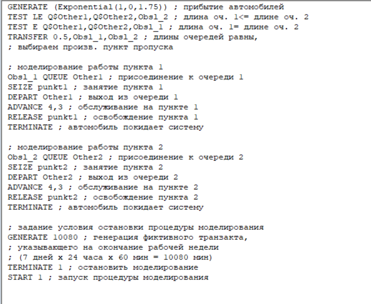

После запуска симуляции получим отчёт (рис. [-@fig:002]).

## Выполнение лабораторной работы

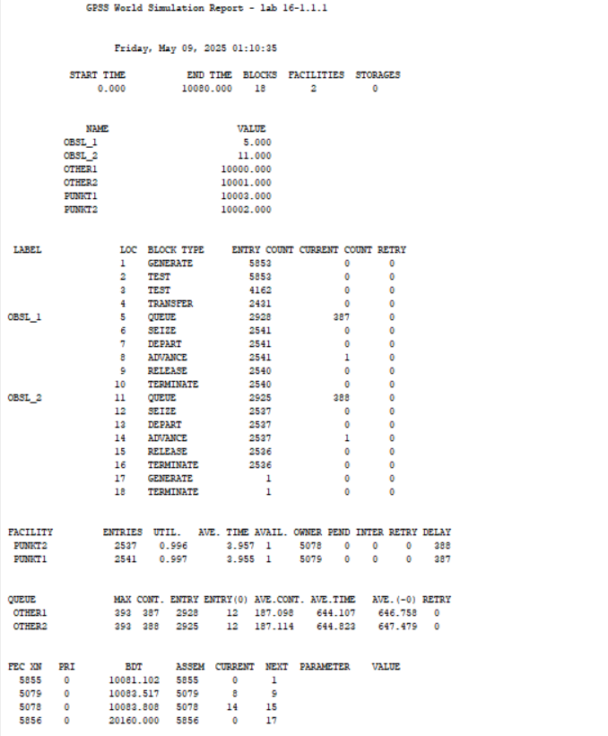

Составим модель для второй стратегии обслуживания, когда прибывающие автомобили образуют одну очередь и обслуживаются освободившимся пропускным пунктом (рис. [-@fig:003], [-@fig:004]).

## Выполнение лабораторной работы

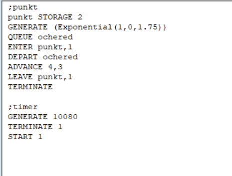

## Выполнение лабораторной работы

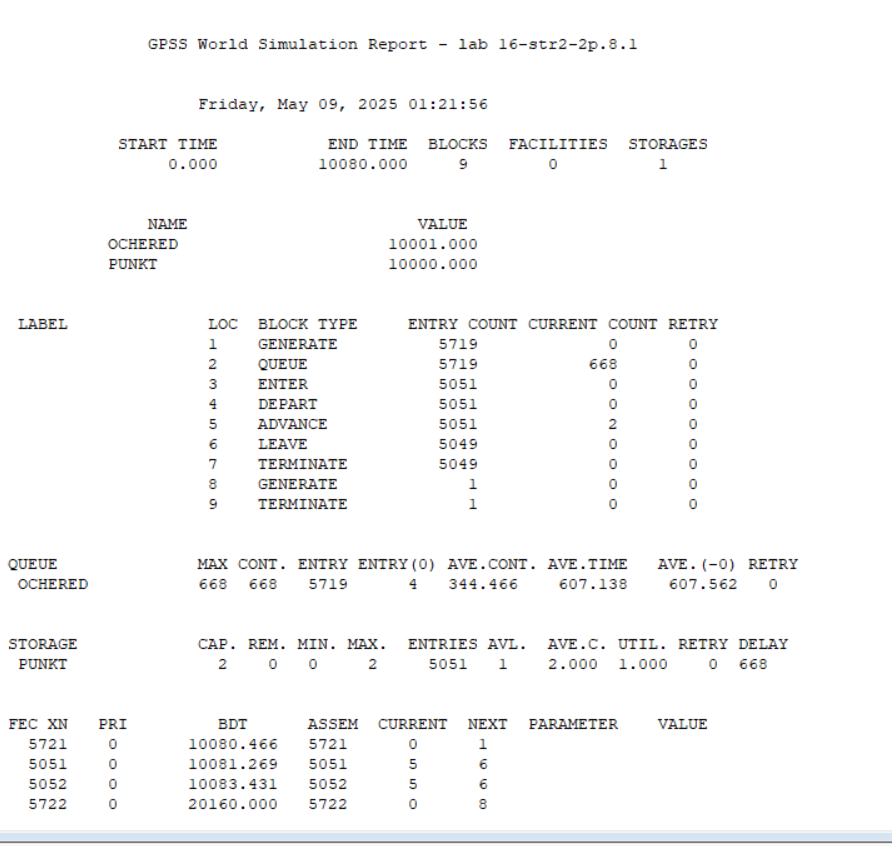

Составим таблицу по полученной статистике (табл. [-@tbl:strategy]).

: Сравнение стратегий {#tbl:strategy}:

| Показатель                 | стратегия 1 |         |          |  стратегия 2 |
|----------------------------|-------------|---------|----------|--------------|
|                            | пункт 1     | пункт 2 | в целом  |              |
| Поступило автомобилей      | 2928        | 2925    | 5853     | 5719         |
| Обслужено автомобилей      | 2540        | 2536    | 5076     | 5049         |
| Коэффициент загрузки       | 0,997       | 0,996   | 0,9965   | 1            |
| Максимальная длина очереди | 393         | 393     | 786      | 668          |
| Средняя длина очереди      | 187,098     | 187,114 | 374,212  | 344,466      |
| Среднее время ожидания     | 644,107     | 644,823 | 644,465  | 607,138      |

Сравнив результаты моделирования двух систем, можно сделать вывод о том,
что первая модель позволяет обслужить большее число автомобилей. Однако мы
видим, что разница между обслуженными и поступившими автомобилями меньше
для второй модели – значит, продуктивность работы выше. Также для второй модели коэффициент загрузки равен 1 -- значит ни один из
пунктов не простаивает. Максимальная длина очереди, средняя длина очереди и
среднее время ожидания меньше для второй стратегии. Можно сделать вывод, что
вторая стратегия лучше.

## Оптимизация модели двух стратегий обслуживания

Изменим модели, чтобы определить оптимальное число пропускных пунктов (от 1 до 4). Будем подбирать под следующие критерии:

- коэффициент загрузки пропускных пунктов принадлежит интервалу [0, 5; 0, 95];
- среднее число автомобилей, одновременно находящихся на контрольно пропускном пункте, не должно превышать 3;
- среднее время ожидания обслуживания не должно превышать 4 мин.

Для обеих стратегий модель с одним пунктом выглядит одинаково (рис. [-@fig:005]).

## Выполнение лабораторной работы

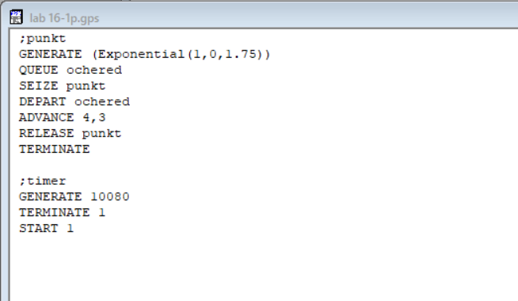

После симуляции получим следующий отчет (рис. [-@fig:005]).

## Выполнение лабораторной работы

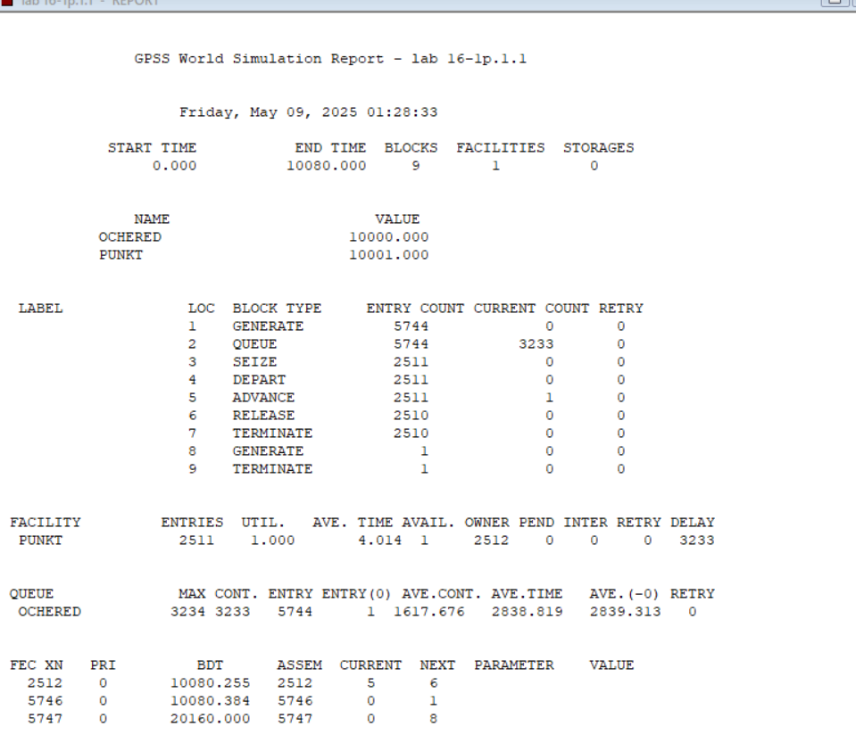

В этом случае модель не проходит ни по одному из критериев, так как коэффициент загрузки, размер очереди и среднее время ожидания больше.

Построим модель для первой стратегии с 3 пропускными пунктами и получим отчет (рис. [-@fig:007], [-@fig:008]).

## Выполнение лабораторной работы

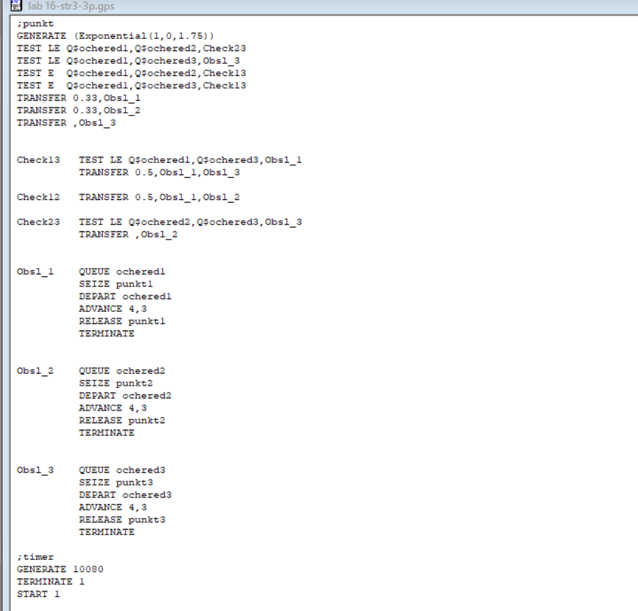

## Выполнение лабораторной работы

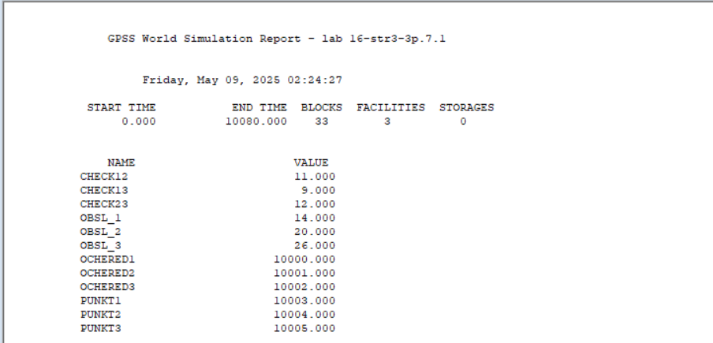 

## Выполнение лабораторной работы

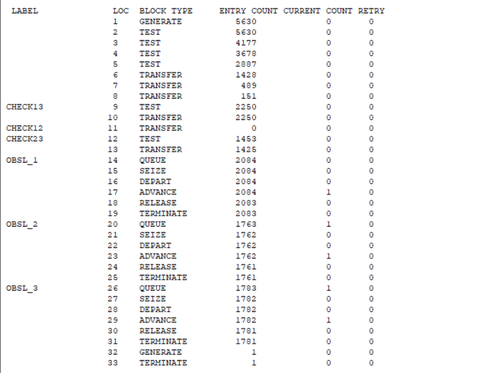

## Выполнение лабораторной работы

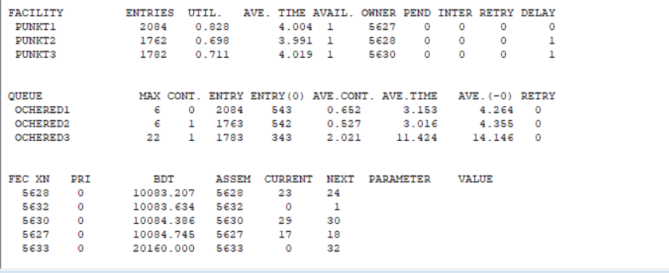

В этом случае среднее количество автомобилей в очереди меньше 3 и коэффициент загрузки в нужном диапазоне, но среднее время ожидания больше 4.

Построим модель для первой стратегии с 4 пропускными пунктами (рис. [-@fig:009], [-@fig:010]).

## Выполнение лабораторной работы

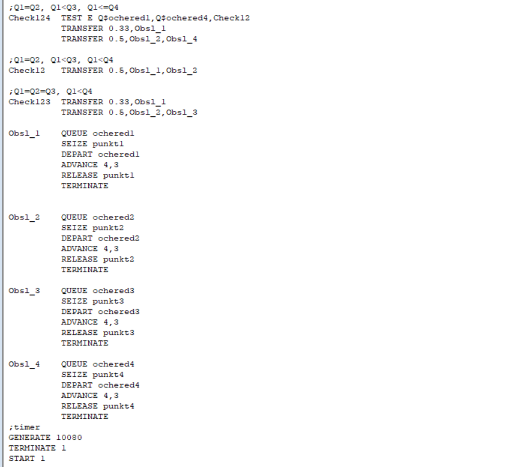

## Выполнение лабораторной работы

В этом случае все критерии выполнены, поэтому 4 пункта являются *оптимальным* количеством для первой стратегии.

Построим модель для второй стратегии с 3 пропускными пунктами и получим отчет (рис. [-@fig:011], [-@fig:012]).

## Выполнение лабораторной работы

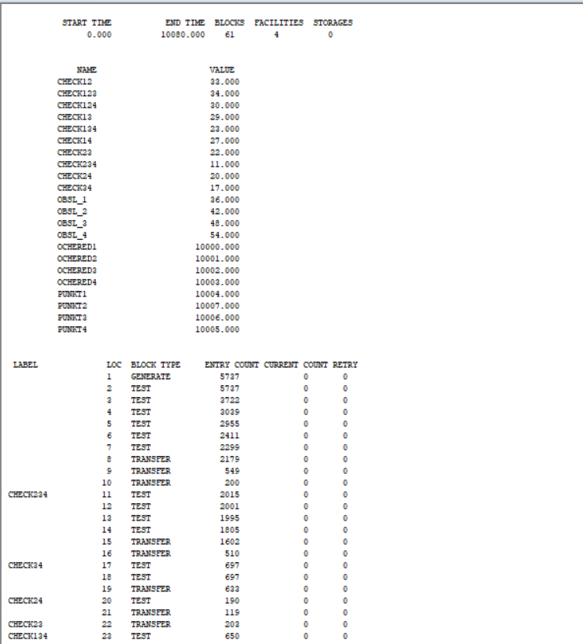

## Выполнение лабораторной работы

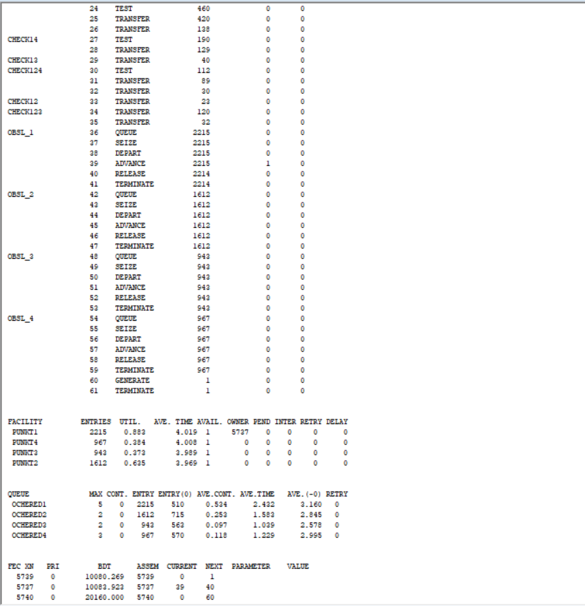

В этом случае все критерии выполняются, поэтому модель *оптимальна*.

Построим модель для второй стратегии с 4 пропускными пунктами и получим отчет (рис. [-@fig:011], [-@fig:012]).

## Выполнение лабораторной работы

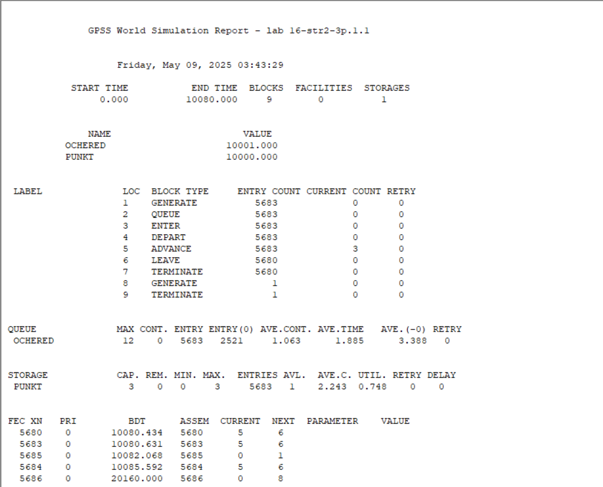

## Выполнение лабораторной работы

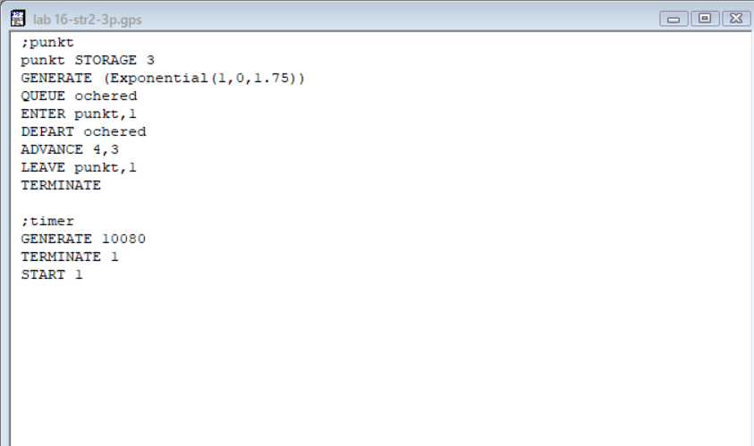

## Выполнение лабораторной работы

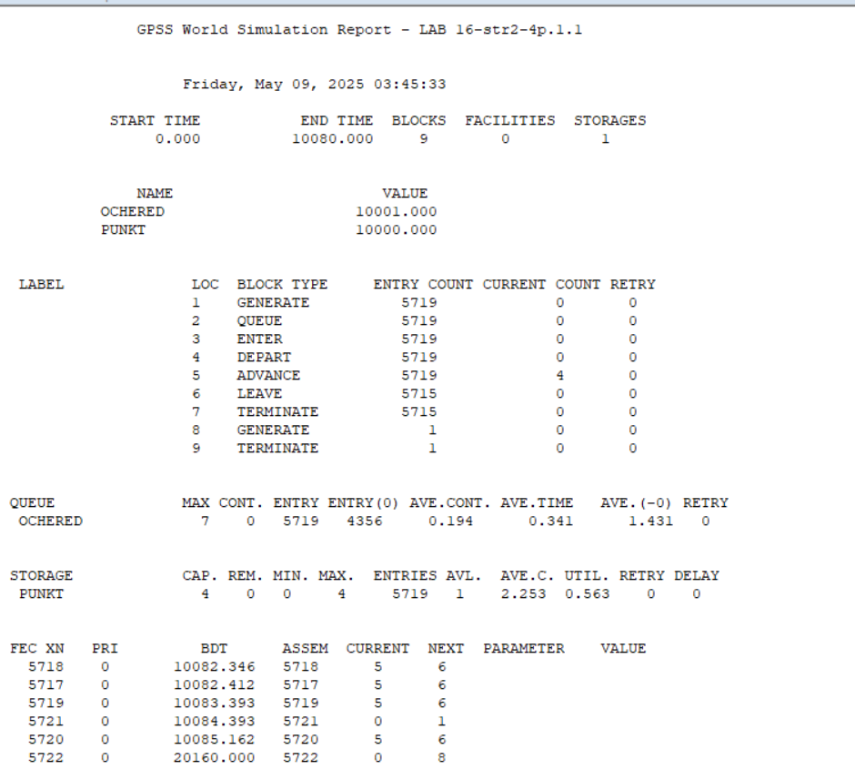 

## Выполнение лабораторной работы

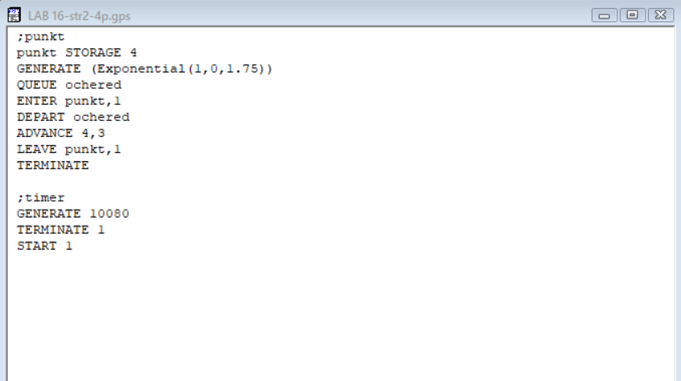

Здесь все критерии выполнены при этом время ожидания и среднее число автомобилей меньше, чем в случе второй стратегии с 3 пунктами, однако и загрузка меньше. Можно сделать вывод, что 4 пропускной пункт излишне разгружает систему.

В результате анализа наилучшим количеством пропускных пунктов будет *3 при втором типе обслуживания* и *4 при первом*.

## Выводы

В результате выполнения данной лабораторной работы я реализовал с помощью gpss:

- модель с двумя очередями;
- модель с одной очередью;
- изменить модели, чтобы определить оптимальное число пропускных пунктов.