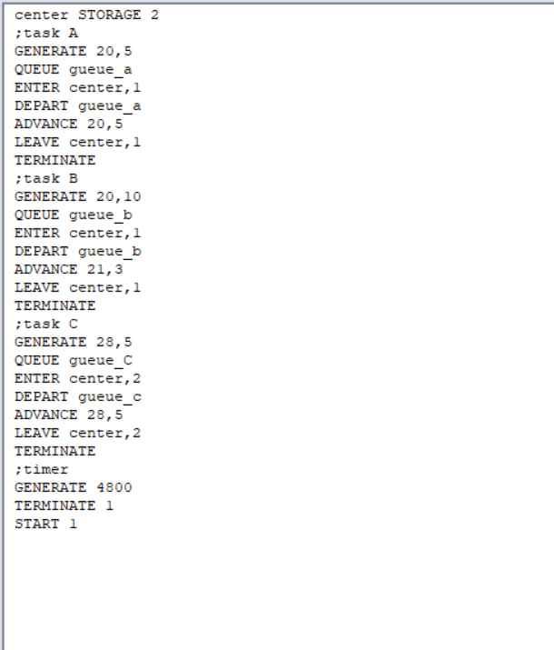
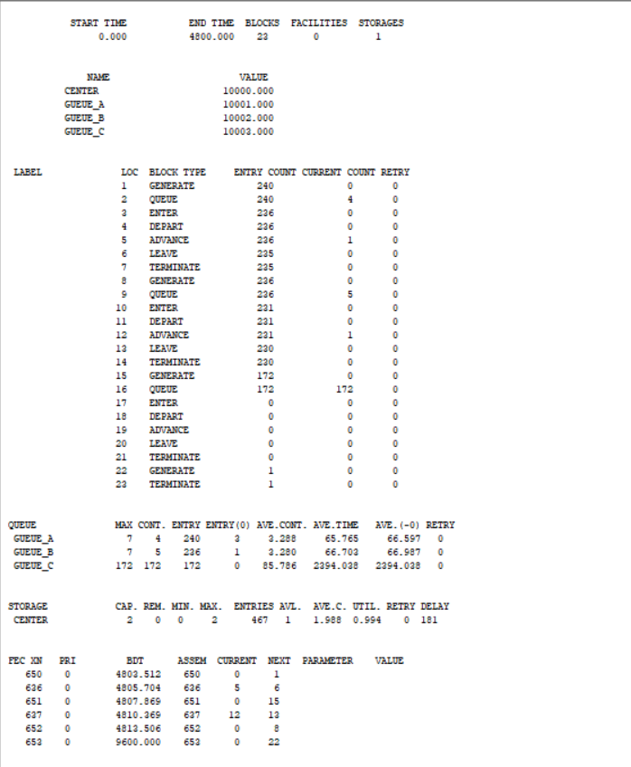
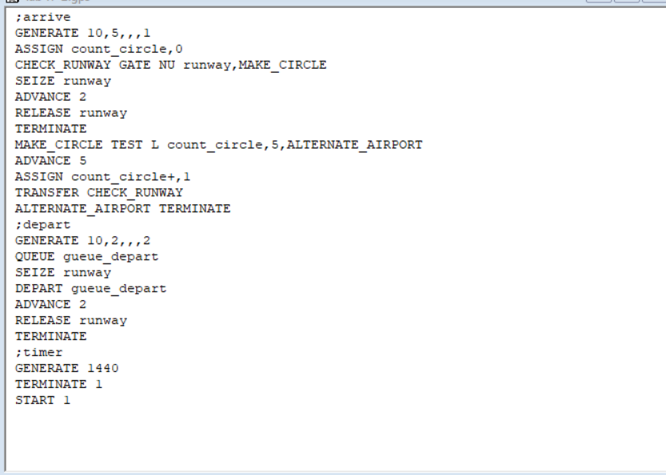
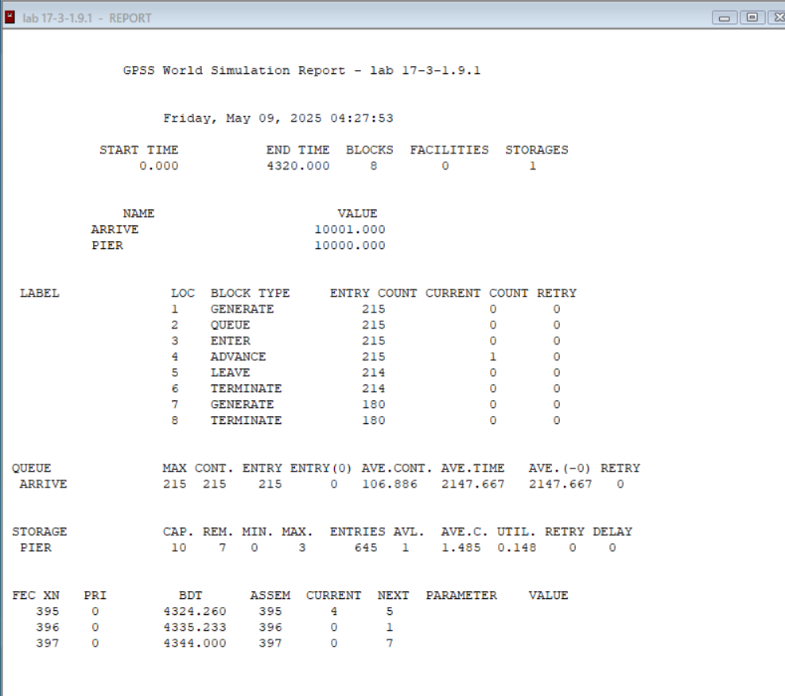
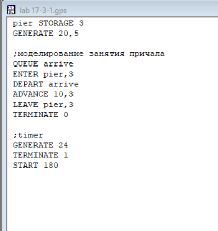
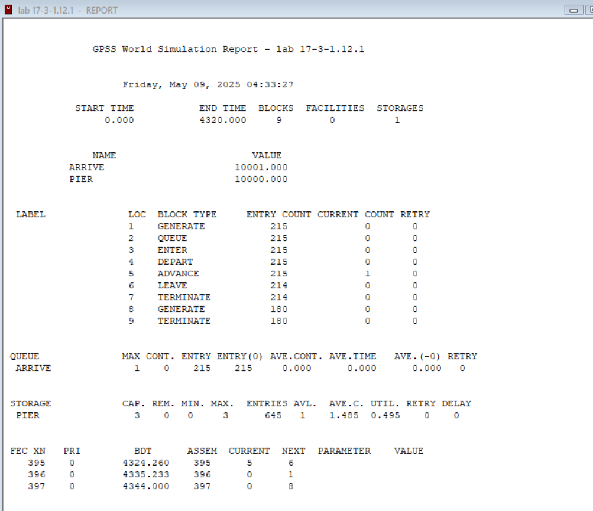
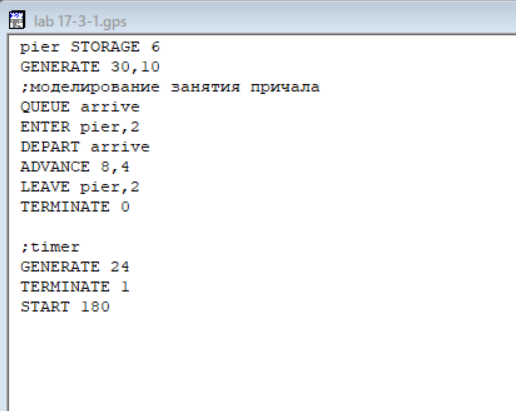
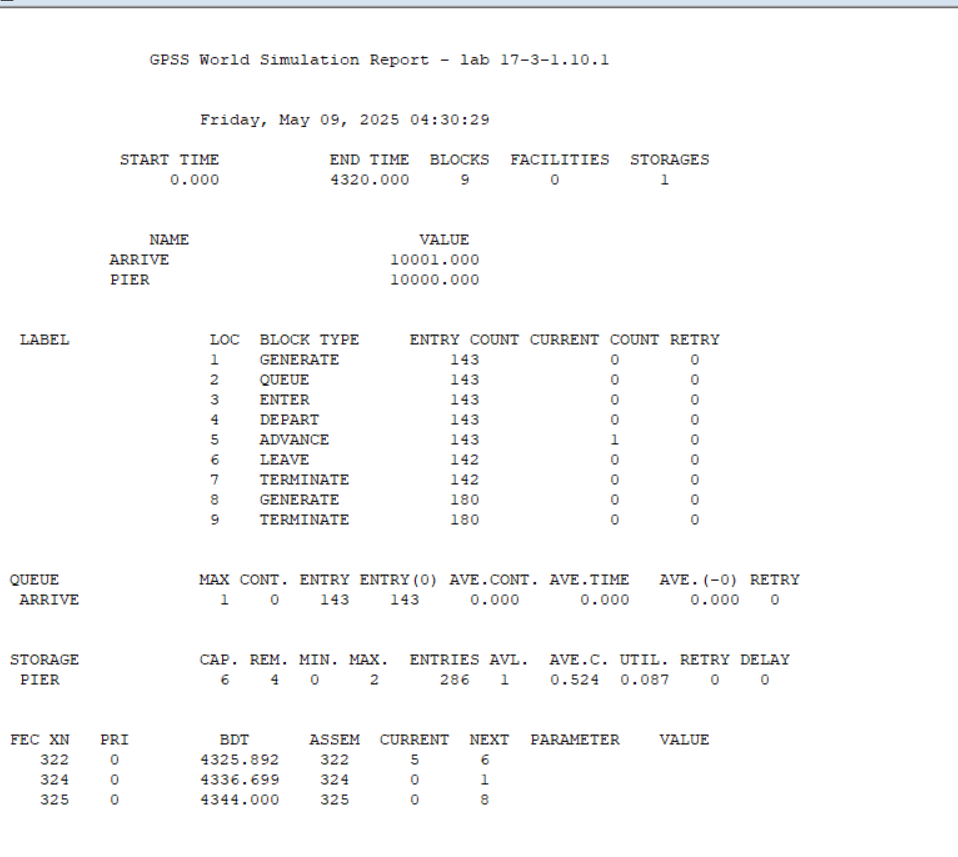
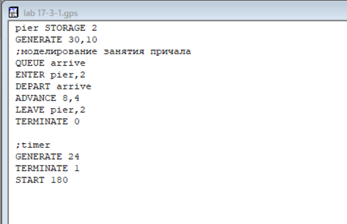
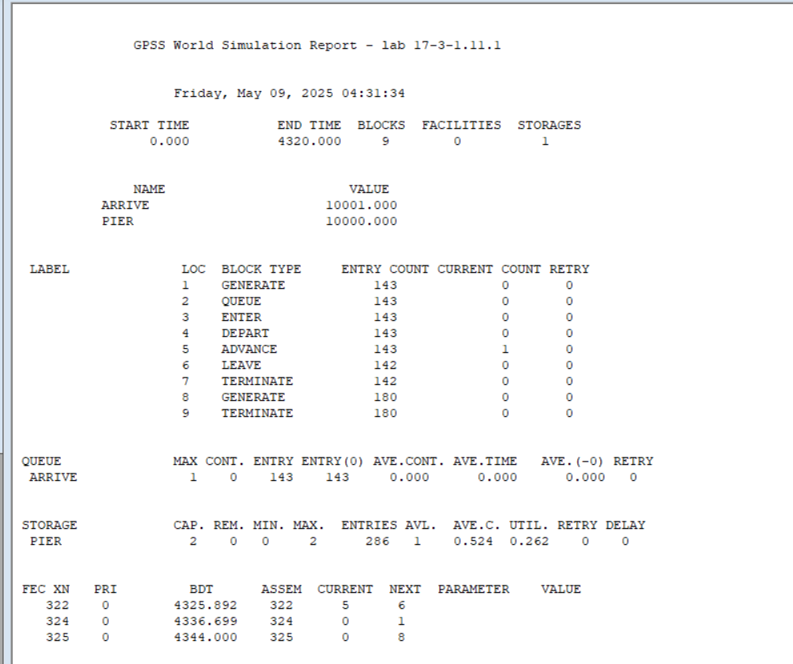

---
## Front matter
lang: ru-RU
title: Лабораторная работа №17
subtitle: Задания для самостоятельной работы
author:
  - Джахангиров Илгар Залид оглы
institute:
  - Российский университет дружбы народов, Москва, Россия

## i18n babel
babel-lang: russian
babel-otherlangs: english

## Formatting pdf
toc: false
toc-title: Содержание
slide_level: 2
aspectratio: 169
section-titles: true
theme: metropolis
header-includes:
 - \metroset{progressbar=frametitle,sectionpage=progressbar,numbering=fraction}
 - '\makeatletter'
 - '\beamer@ignorenonframefalse'
 - '\makeatother'
---

# Информация

## Докладчик

:::::::::::::: {.columns align=center}
::: {.column width="70%"}

  * Джахангиров Илгар Залид оглы
  * студент
  * Российский университет дружбы народов
  * [1032225689@pfur.ru]

:::
::::::::::::::

## Цель работы

Реализовать с помощью gpss модели работы вычислительного центра, аэропорта и морского порта.

## Задание

Реализовать с помощью gpss:

- модель работы вычислительного центра;
- модель работы аэропорта;
- модель работы морского порта.

## Выполнение лабораторной работы

## Моделирование работы вычислительного центра

На вычислительном центре в обработку принимаются три класса заданий А, В и С. Исходя из наличия оперативной памяти ЭВМ задания классов А и В могут решаться одновременно, а задания класса С монополизируют ЭВМ. Задачи класса С загружаются в ЭВМ, если она полностью свободна. Задачи классов А и В могут дозагружаться к решающей задаче. 

Смоделируем работу ЭВМ за 80 ч. и определим её загрузку.

Построим модель (рис. [-@fig:001]).

## Выполнение лабораторной работы

Задается хранилище ram на две заявки. Затем записаны три блока: первые два обрабатывают задания класса A и B, используя один элемент ram, а третий обрабатывает задания класса C, используя два элемента ram. Также есть блок времени генерирующий 4800 минут (80 часов).

После запуска симуляции получаем отчёт (рис. [-@fig:002], [-@fig:003]).

## Выполнение лабораторной работы

Из отчета увидим, что загруженность системы равна 0.994.

## Модель работы аэропорта

Самолёты прибывают для посадки в район аэропорта каждые $10 \pm 5$ мин. Если взлетно-посадочная полоса свободна, прибывший самолёт получает разрешение на посадку. Если полоса занята, самолет выполняет полет по кругу и возвращается в аэропорт каждые 5 мин. Если после пятого круга самолет не получает разрешения на посадку, он отправляется на запасной аэродром.

В аэропорту через каждые $10 \pm 2$ мин к взлетно -посадочной полосе выруливают готовые к взлёту самолёты и получают разрешение на взлёт, если полоса свободна. Для взлета и посадки самолёты занимают полосу ровно на 2 мин. Если при свободной полосе одновременно один самолёт прибывает для посадки, а другой -- для взлёта, то полоса предоставляется взлетающей машине.

Требуется:

- выполнить моделирование работы аэропорта в течение суток;
- подсчитать количество самолётов, которые взлетели, сели и были направлены на запасной аэродром;
- определить коэффициент загрузки взлетно-посадочной полосы.

Построим модель (рис. [-@fig:004]).

## Выполнение лабораторной работы

Блок для влетающих самолетов имеет приоритет 2, для прилетающий приоритет 1 (чем выше значение, тем выше приоритет). Происходит проверка: если полоса пустая, то заявка просто отрабатывается, если нет, то происходит переход в блок ожидания. При ожидании заявка проходит в цикле 5 раз, каждый раз проверяется не освободилась ли полоса, если освободилась -- переход в блок обработки, если нет -- самолет обрабатывается дополнительным обработчиком отправления в запасной аэродром. Время задаем в минутах -- 1440 (24 часа).

После запуска симуляции получаем отчёт (рис. [-@fig:005], [-@fig:006]).

## Выполнение лабораторной работы

Взлетело 142 самолета, село 146, а в запасной аэропорт отправилось 0. В запасной аэропорт не отправились самолеты, поскольку процессы обработки длятся всего 2 минуты, что намного быстрее, чем генерации новых самолетов. Коэффициент загрузки полосы равняется 0.4, полоса большую часть времени не используется.

## Моделирование работы морского порта

Морские суда прибывают в порт каждые $[\alpha \pm \delta]$ часов. В порту имеется N причалов. Каждый корабль по длине занимает M причалов и находится в порту $[b \pm \varepsilon]$ часов.
Требуется построить GPSS-модель для анализа работы морского порта в течение полугода, определить оптимальное количество причалов для эффективной работы порта.

Рассмотрим два варианта исходных данных:

1) $a = 20$ ч, $\delta = 5$ ч, $b = 10$ ч, $\varepsilon = 3$ ч, $N = 10$, $M = 3$;
2) $a = 30$ ч, $\delta = 10$ ч, $b = 8$ ч, $\varepsilon = 4$ ч, $N = 6$, $M = 2$.

**Первый вариант модели**

Построим модель для первого варианта (рис. [-@fig:007]).

## Выполнение лабораторной работы

После запуска симуляции получаем отчёт (рис. [-@fig:008]).

## Выполнение лабораторной работы

При запуске с 10 причалами видно, что судна обрабатываются быстрее, чем успевают приходить новые, так как очередь не набирается. Кроме того загруженность причалов очень низкая. Соответственно, установив наименьшее возможное число причалов -- 3 (рис. [-@fig:009]), получаем оптимальный результат, что видно на отчете (рис. [-@fig:010]).

## Выполнение лабораторной работы

## Выполнение лабораторной работы

**Второй вариант модели**

Построим модель для второго варианта (рис. [-@fig:011]).

## Выполнение лабораторной работы

После запуска симуляции получаем отчёт (рис. [-@fig:012]).

## Выполнение лабораторной работы

При запуске с 6 причалами видно, что судна обрабатываются быстрее, чем успевают приходить новые, так как очередь не набирается. Кроме того загруженность причалов очень низкая. Соответственно, установив наименьшее возможное число причалов -- 2 (рис. [-@fig:013]), получаем оптимальный результат, что видно из отчета (рис. [-@fig:014]).

## Выполнение лабораторной работы

## Выполнение лабораторной работы

## Выводы

В результате выполнения данной лабораторной работы я реализовал с помощью gpss:

- модель работы вычислительного центра;
- модель работы аэропорта;
- модель работы морского порта.